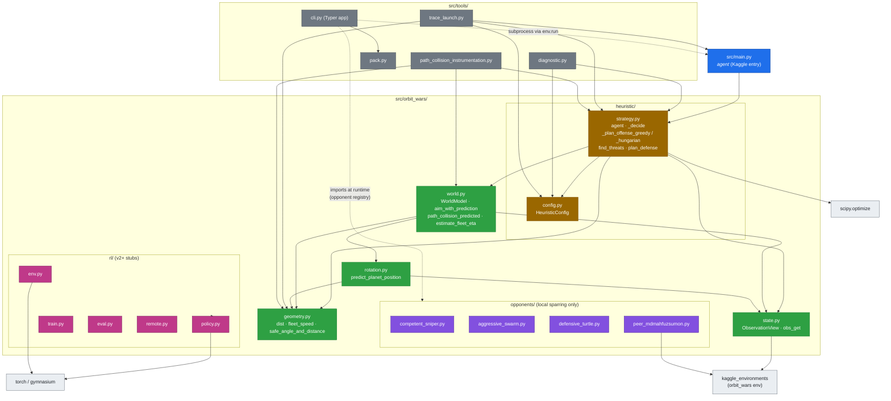
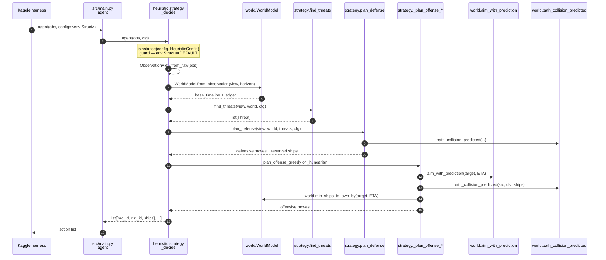
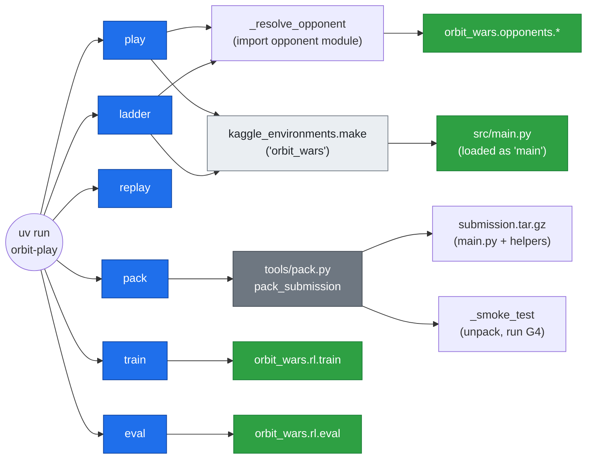
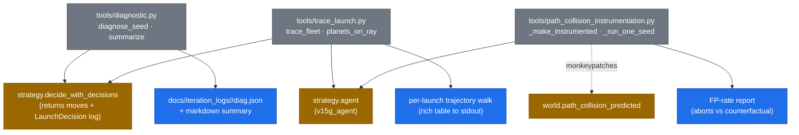
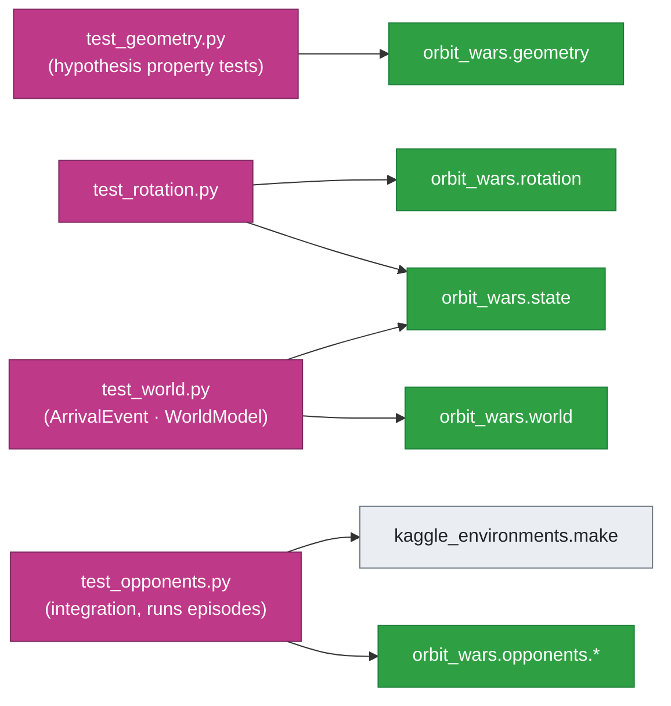

# Wanderduck's Orbit Wars Submission

-   This project contains my submission to the Kaggle Competition: [Orbit Wars](https://www.kaggle.com/competitions/orbit-wars/overview)

[[[ **NOTE**: This README.md is incomplete; this is just a placeholder.]]]

## File Structure

-   **docs/**: directory containing various documentation files, primarily in Markdown format
-   **src/**: directory containing any user created `.py` or otherwise scripts I may use to develop or submit my competition submission
-   **notebooks**: directory containing any `.ipynb` files for creating, editing, or submitting my submission (if needed)
-   **images**: directory containing any images used in `.ipynb` notebooks or `.md` Markdown files (or anywhere else)

---

## Codebase Flow

Visual map of the Orbit Wars repository: how the source tree is laid out, which file imports which, and what runs at submission time vs. local development time.

The submission entry point is `src/main.py`. Everything else is either a helper module that backs the agent (`src/orbit_wars/`), a local-only opponent or RL scaffold (not packaged into submissions), or developer tooling (`src/tools/`, `tests/`).

---

### 1. Module dependency graph (`src/`)

Top-down view of the import graph. An arrow `A --> B` means "A imports from B". Third-party packages (`scipy`, `numpy`, `torch`, `gymnasium`, `typer`, `kaggle_environments`) are shown only where they materially shape the design.

Key takeaways:

-   The submission's transitive closure is just `main.py → heuristic.strategy → {world, state, geometry, rotation, heuristic.config}`. That is the entire set of files bundled into `submission.tar.gz`.
-   `opponents/`, `rl/`, and `tools/` are **never imported by `main.py`**. They exist for local play, future RL work, and developer tooling respectively.
-   `state.py` is the single seam to `kaggle_environments` for tuple/struct types (`Planet`, `Fleet`, etc.). Everything downstream consumes the `ObservationView` adapter rather than raw `obs`.

---

### 2. Per-turn agent call flow

What actually runs when Kaggle calls `agent(obs)` once per turn (≤ 1 second wall clock). Sequence of function calls inside `heuristic.strategy._decide`.

Critical invariants (from `CLAUDE.md`):

-   `agent` is **stateless by contract**. Any module-level cache must be keyed by `obs.player` or reset per episode.
-   The `config=None` second positional arg trap: `kaggle_environments` passes its env Struct as `config`. The `isinstance(config, HeuristicConfig)` guard in `_decide` is what prevents the silent `[]`-every-turn failure mode.
-   Path-clearance must use the moving-planet predictor (`path_collision_predicted`), not a static-position check at launch time.

---

### 3. CLI surface (`uv run orbit-play …`)

`tools.cli` is a Typer app that wires together opponents, the diagnostic harness, and the submission packager. It is the only file that knows how to mix-and-match the rest of the repo.

Notes:

-   `pack` runs a built-in G4 smoke test that unpacks the tarball into a temp dir and invokes the bundled `main.py` against `random` — catches missing helper modules before submission.
-   `play` and `ladder` invoke `main.py` via subprocess paths handled by `kaggle_environments.env.run`; the file is loaded as a module named `main`, which is also the name `tools/trace_launch.py` imports under.

---

### 4. Diagnostic tooling

When the agent loses or behaves oddly, **diagnose before fixing**. Three instrumentation tools attach to the agent at different layers.

What each tool answers:

-   **`diagnostic.py`** — *Why did this game's launches not capture?* Walks `env.steps` to label every launch (`captured`, `still-neutral-at-arrival`, `fleet-destroyed-in-transit`, etc).
-   **`trace_launch.py`** — *Where exactly did this one fleet die?* Picks specific launches by target type and walks the env step-by-step.
-   **`path_collision_instrumentation.py`** — *Is the path-collision predictor too aggressive?* Monkey-patches the predictor, logs every abort, and computes a false-positive rate against counterfactual replays. (Closed the loop on the v1.5G `0.3% FP` rate result.)

---

### 5. Test-to-source map

`tests/` mirrors the `orbit_wars` package one-to-one for the geometry/world math. `test_opponents.py` is the only integration test — it spins up `kaggle_environments` and runs full episodes.

Run all: `uv run pytest -q` (37 tests, ~1s for unit tests, slower for opponent integration). Mark slow tests with `@pytest.mark.slow` and gate via `-m slow`.

---

## Quick reference: what ships vs. what doesn't

| Path | Shipped in `submission.tar.gz`? | Purpose |
| :-------: | :-------: | :-------: |
| `src/main.py` | yes (as `main.py` at tar root) |Kaggle entry point |
| `src/orbit_wars/{state,world,rotation,geometry}.py` |yes| Math + observation adapters |
| `src/orbit_wars/heuristic/{strategy,config}.py` | yes | Decision logic|
| `src/orbit_wars/opponents/*` | **no** | Local sparring partners only |

`src/orbit_wars/rl/*`

**no**

v2+ RL scaffold (stubs)

`src/tools/*`

**no**

Developer CLI / instrumentation

`tests/*`

**no**

Test suite

The submission tarball is built by `tools/pack.py:pack_submission`, which flattens the `orbit_wars` package next to `main.py` (Kaggle unpacks into a single working directory — no package layout).