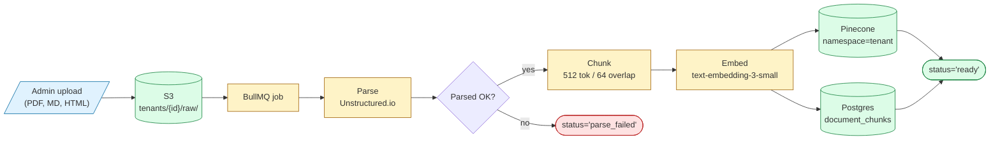
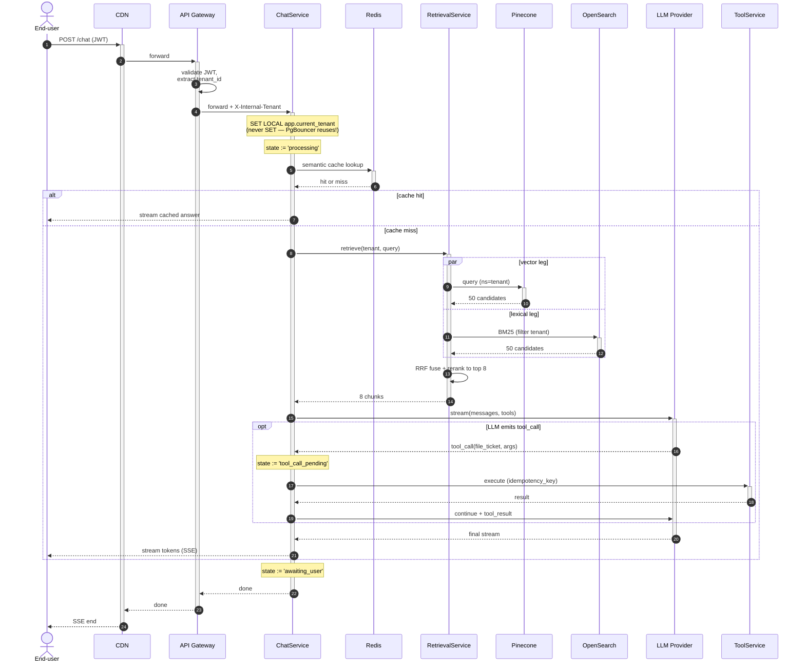
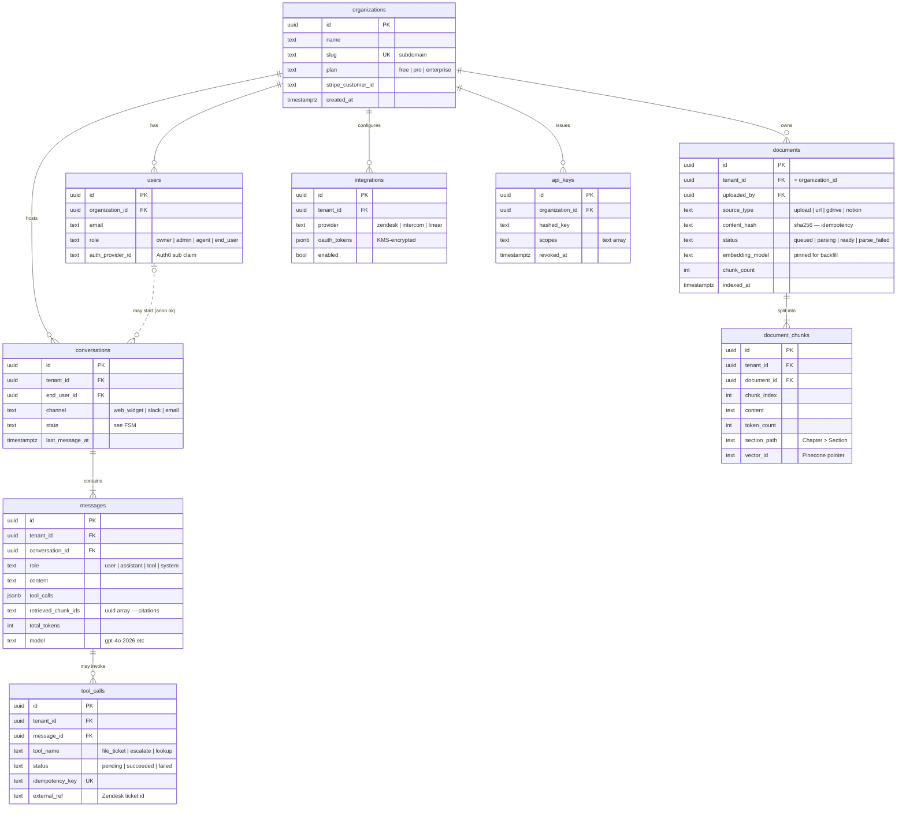
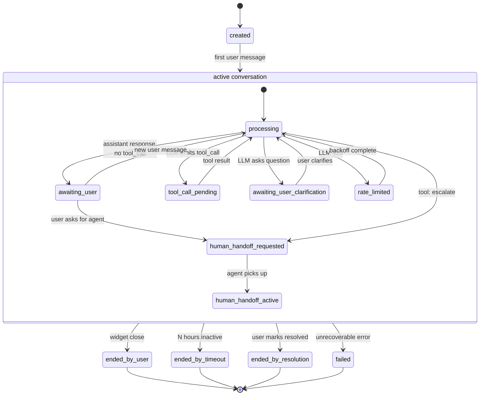
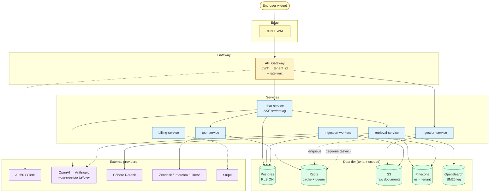

# Lumen — case-study diagrams (review checkpoint)

These are the 5 Mermaid diagrams that will thread through the blog post. Each is paired with the chapter that teaches its corresponding diagram type. Before I write the ~3,000 words of analysis around them, please eyeball each one — it's much cheaper to fix a diagram now than to rewrite prose around a broken one.

**How to review:**
- Paste any diagram into [mermaid.live](https://mermaid.live) to see it render. Your blog renderer should match.
- Flag: render errors, semantic mistakes (wrong cardinality, wrong arrow direction, missing component), or things that look cluttered/unclear.
- Don't worry about colors yet — the `classDef` palettes are placeholders, easy to swap.

Targeted Mermaid version: **11.14.0** (matches what GitHub and most modern hosts ship).

---

## Diagram 1 — RAG ingestion pipeline (`flowchart LR`)

**Where in post:** Case study #1 (after §4 — cross-cutting syntax). The on-ramp diagram. Smallest, simplest.

**What it represents:** When a Lumen admin uploads a document (PDF, Markdown, HTML), this is the asynchronous pipeline that ingests it. Upload lands in S3, gets queued, picked up by a worker, parsed, chunked, embedded, and indexed into both Pinecone (vector) and Postgres (text + metadata).

**Mermaid features it teaches:**
- `flowchart LR` direction
- Node shapes: parallelogram input (`[/.../]`), cylinder for storage (`[(...)]`), stadium for terminal status (`([...])`), rhombus for decision (`{...}`), default rectangle for processes
- `classDef` colors as a *role vocabulary* (input / process / store / failure)
- Edge labels via `|...|`
- Multi-line node labels with ` `

---

## Diagram 2 — Chat request lifecycle (`sequenceDiagram`)

**Where in post:** Case study #2 (after §6 — sequenceDiagram chapter). Densest of the five.

**What it represents:** A single end-user chat turn, from widget to streaming response. Includes the multi-tenancy enforcement contract (`SET LOCAL` to avoid the PgBouncer footgun), semantic cache check, parallel hybrid retrieval (vector + BM25), reranking, LLM streaming, and an optional tool-call interjection.

**Mermaid features it teaches:**
- `actor` vs `participant` distinction
- `autonumber` directive
- `+`/`-` activation shorthand (and the discipline of balancing them)
- `alt` / `else` blocks (cache hit vs miss)
- `par` / `and` blocks (parallel retrieval)
- `opt` blocks (conditional tool-call branch)
- `Note over` (the load-bearing PgBouncer/RLS contract callout)
- Multi-line note text with ` `

---

## Diagram 3a — Lumen schema (`erDiagram`)

**Where in post:** Case study #3a (within §7). Paired with the erDiagram chapter.

**What it represents:** The relational schema for Lumen. Every tenant-scoped table carries `tenant_id` (denormalized to make Postgres RLS policies cheap to write). Includes the document/chunk hierarchy, the conversation/message/tool_call lineage, multi-tenant org/user/api_key tables, and `audit_log` (omitted from the diagram for space — would otherwise crowd it).

**Mermaid features it teaches:**
- Cardinality outside-in (`||--o{`, `||..o{`, `||--|{`, `|o..o{`)
- Identifying (`--`) vs non-identifying (`..`) relationships
- Key markers: `PK`, `FK`, `UK`
- Attribute comments (the trailing `"..."` strings)
- Realistic Postgres types (`uuid`, `jsonb`, `timestamptz`, `text[]`)

---

## Diagram 3b — Conversation FSM (`stateDiagram-v2`)

**Where in post:** Case study #3b (within §7). Paired with the stateDiagram-v2 chapter.

**What it represents:** The lifecycle states a Lumen conversation passes through. Most "AI chat FSM" diagrams collapse everything into a few neat states; this one names the messy ones real systems actually have — `tool_call_pending` distinct from `processing`, `rate_limited` as a first-class state (because the UX differs), `human_handoff_requested` distinct from `human_handoff_active` (the queue wait is observable), and several distinct terminal states.

**Mermaid features it teaches:**
- `stateDiagram-v2` (the modern one — never `stateDiagram` alone)
- `[*]` as both start and end (and how its meaning is contextual to scope)
- Composite states (`state "..." as ... { ... }`) — note the wrapper around the in-progress states
- `direction TB` at top level (and that you'd use `direction LR` inside a composite to override)
- Transition labels via `: label`

---

## Diagram 4 — System architecture topology (`flowchart TD` — the capstone)

**Where in post:** Case study #4 (after §8 — specialty diagrams). The capstone. Demonstrates the most techniques.

**What it represents:** Lumen's full system topology. Five tiers, each in its own subgraph: Edge (CDN+WAF), Gateway, Services, Data, External. The dotted edges signal asynchronous interactions (queue enqueue/dequeue between ingestion-service and workers via Redis). Multi-tenancy enforcement is visually anchored in three places: the gateway extracts `tenant_id`, Postgres has RLS ON, and Pinecone uses namespace-per-tenant.

**Mermaid features it teaches:**
- `flowchart TD` with multiple `subgraph` blocks
- `direction LR` *inside* a subgraph overriding the parent direction (so service rows lay out horizontally)
- `classDef` as a *5-color tier vocabulary* — readers learn it once and parse the diagram fast
- Solid edges for synchronous calls, dotted edges (`-.->`) with labels for async/queue interactions
- Stadium nodes for entry points (the end-user widget), cylinders for data stores
- HTML in labels (`<i>...</i>`) — works under default `htmlLabels: true`

---

## What I'd specifically like you to flag

1. **Render errors.** Anything that doesn't render cleanly in your blog renderer or in mermaid.live.
2. **Semantic mistakes.** Wrong arrow direction, miscounted cardinality, missing component you'd expect to see, state machine transition that doesn't make sense.
3. **Clutter.** If any diagram feels too busy to read at a glance, the analysis prose around it will feel that way too.
4. **Color vocabulary.** The classDef palettes are first-pass and meant to be readable on both light and dark backgrounds. If your blog uses dark mode, these may need swapping. Easy fix once we know the target context.
5. **Anything that doesn't match how Lumen "should" work.** The architecture brief in `docs/blog/research/agent_F_architecture_brief.md` is the source of truth for what's depicted; if a diagram contradicts it, that's a bug.

After you sign off (or send back changes), I'll write the ~3,000 words of analysis around these and the ~7,000 of surrounding chapters.
