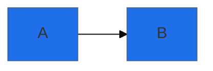
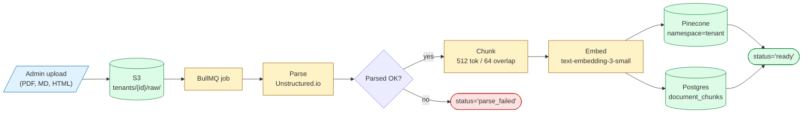
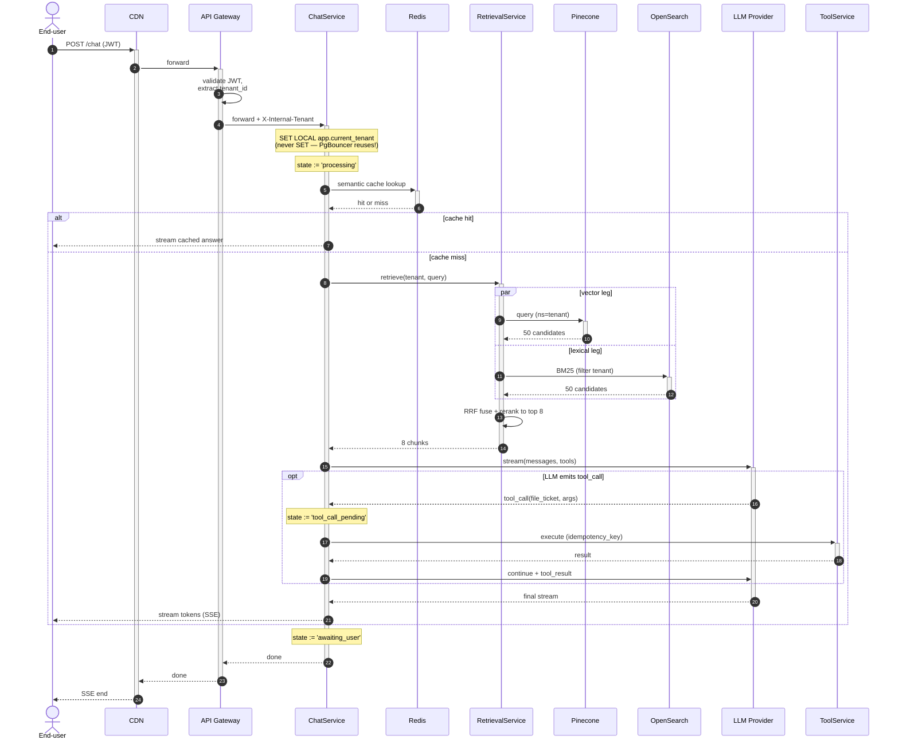
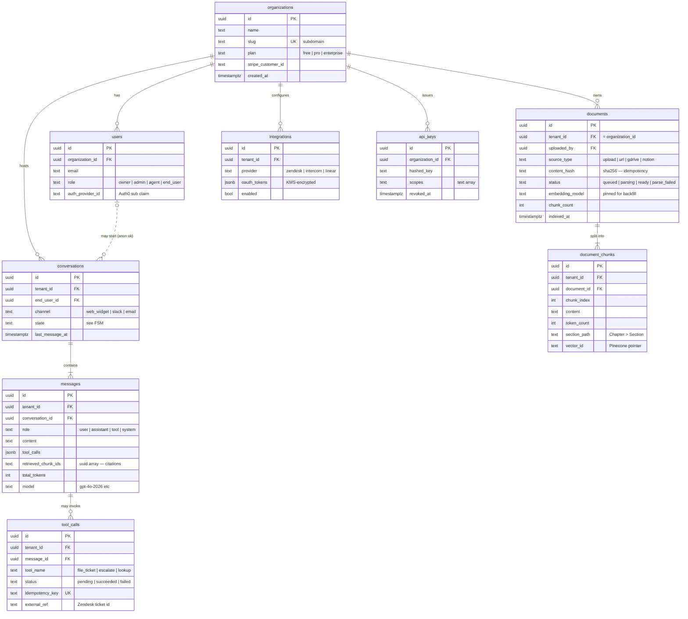
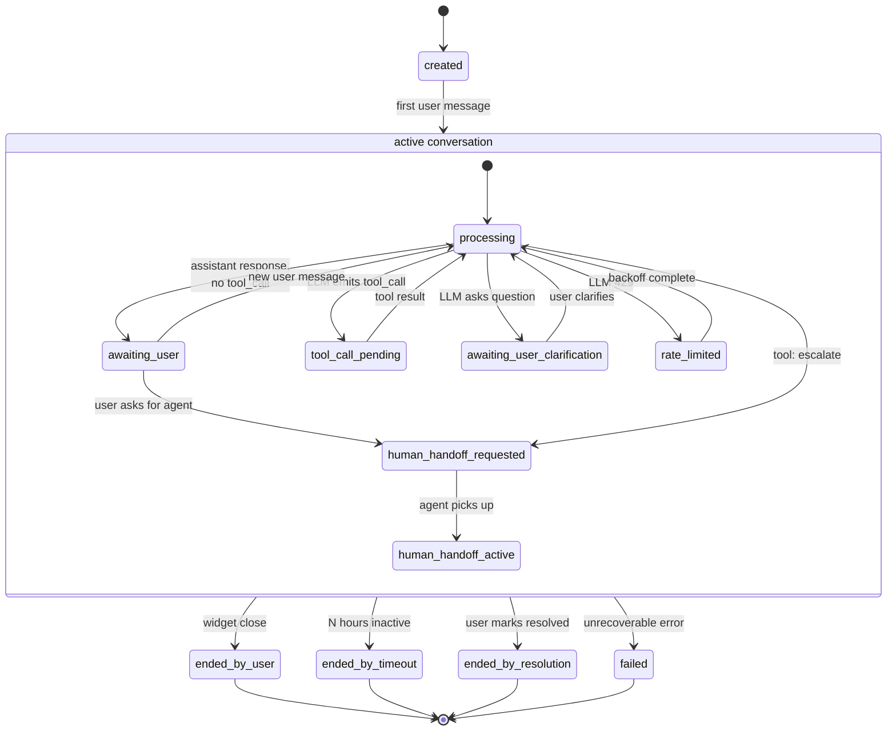
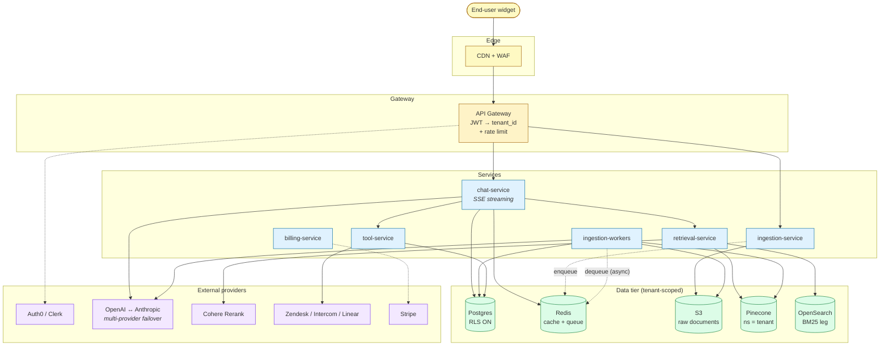

# Floundering with Mermaid? A Sea-Deep Dive into Diagramming and Smooth Sailing Syntax

## §1 — The Confluence problem

Picture this — you've probably lived it. A new engineer joins your team. On day three they ask the question every senior engineer dreads: *"Where can I read about how the system fits together?"* You point them at Confluence. They open the page. The architecture diagram was last modified eighteen months ago by someone who left twelve. Two of the boxes are services since merged into one. One arrow points to a database that was decommissioned, another to a service that was never built. There's no way to tell what's true except by reading the code — at which point the diagram has stopped helping.

This is what diagram rot looks like, and it is structural. We don't fail to keep them current because we're lazy. We fail because the diagrams live somewhere else from the code — different domain, different login, different editor, different review process. When a service gets renamed, nothing tells the engineer doing the renaming that a diagram somewhere references the old name; by the time anyone notices, the gap has widened by a year. The usual response is process — *every PR that touches architecture must update Confluence* — and the usual response to *that* is for the process to fall over the first week, because Confluence isn't part of the engineering working surface. Diagrams there are read-by-others, not read-by-self. They never become load-bearing.

The better fix is structural. Move the diagrams into the codebase. Put them in plain text. Render them at view time from text reviewers are already reading. Now a service rename is one search-and-replace away from updating every diagram that depends on it. Architectural review happens in a PR comment, next to the code that motivated it. A stale diagram is something a `grep` can find, not something the team discovers two years later when a new hire asks about it.

That move — from rendered images to checked-in source — is what this post is about, and Mermaid is the de facto tool for it. It's a small JavaScript library that parses a DSL for diagrams and renders SVG. The DSL is plain text, so it lives in your repo, diffs in PRs, and renders automatically in GitHub, GitLab, MkDocs, Notion, Obsidian, VS Code, and anywhere else that has bothered to add a sixteen-line integration. It has 25 distinct diagram types as of version 11.14, and it has reached the kind of ubiquity where a fenced ` ```mermaid ` block in a Markdown file is something most readers see rendered without thinking about it.

What I want to teach you in the next ten thousand words isn't the documentation version — the docs are excellent, but they'll let you make every mistake I made. The version I want to teach is the one where you already know which footguns are real, which features pay off, and what experienced people do when they reach for a diagram. Along the way we'll build a case study: a hypothetical AI customer-support SaaS called **Lumen**, and five Mermaid diagrams that document its architecture. By the end you'll be able to read those diagrams, understand the choices behind them, and reach for Mermaid in your codebase with the right instincts.

## §2 — How Mermaid actually works

To use Mermaid well you need a small mental model of what it does at the machine level, because every gotcha in this post is downstream of it. Mermaid is a JavaScript library. When a page that includes Mermaid loads, the library scans the DOM for any element with the class `.mermaid` (the convention is `<pre class="mermaid">` or `<div class="mermaid">`). For each match, it reads the element's `textContent`, parses the diagram source, and replaces the element's contents with an inline `<svg>` element. That's it. That's the rendering model.

Three things follow from this. First, the parse-and-replace happens **once**, on `DOMContentLoaded` by default. If you mutate the DOM after Mermaid has run — injecting a diagram into a single-page app via a route change, say — the new element sits there as raw text until you call `mermaid.run()` yourself. Auto-discovery does not observe mutations. Most "Mermaid stopped working in my React app" Stack Overflow questions resolve to this.

Second, after Mermaid runs, the original source text is **gone**. The element's contents have been replaced with the rendered SVG. If you want to support a live theme toggle that re-renders the diagram, you have to stash the original `textContent` somewhere — a `data-source` attribute on the element, a piece of state on the page — *before* the first render, because afterwards there's nothing to re-render from. This is not a quirk the docs flag clearly; you discover it after burning an afternoon on it.

Third, the fenced-block convention you've seen in every README — triple-backtick blocks with `mermaid` after them — is not part of the Mermaid spec. It's a Markdown-renderer convention. GitHub, GitLab, Obsidian, MkDocs, and so on all key off the `mermaid` info-string after the opening backticks; they extract the contents and hand them to a `<pre class="mermaid">` element under the hood, then run Mermaid against the page. Your blog renderer is presumably doing the same. The HTML embed pattern — a literal `<pre class="mermaid">` plus a `<script type="module">` that imports Mermaid and calls `mermaid.initialize` — is what's happening on every platform that doesn't have its own integration.

The practical consequence is that Mermaid is, in some real sense, a string-to-SVG converter, and the integrations are mostly thin wrappers around it. There's a tool called the **live editor** at [mermaid.live](https://mermaid.live), the closest thing Mermaid has to a REPL. You paste source in, see the rendering, see the parse error if there is one, and see the latest version of Mermaid — which matters because GitHub and other hosts pin older versions, and a diagram that works in mermaid.live can fail on the platform you're shipping to. We'll come back to that. For now: when something doesn't render and you can't tell why, the live editor is where you go to find out.

## §3 — Where it renders

Once you've written a diagram, the next question is what it takes to display it. The answer varies by platform, and the variations matter — they determine which version of Mermaid your readers will see, what configuration knobs you have, and which features silently no-op. Here is the surface, in roughly the order you're likely to encounter it.

**GitHub** has rendered Mermaid in fenced blocks across all Markdown surfaces — READMEs, issues, PRs, wikis, gists — since February 2022. By far the most common place readers will see your diagrams. Two real caveats. First, GitHub pins a specific Mermaid version per host, and it trails the latest release. To find out which version, write a code block containing only the word `info` and look at the rendered output; that's a built-in Mermaid diagnostic. Second, GitHub injects its own light/dark CSS variables, so themes adapt to the user's GitHub theme but only roughly. Heavy diagrams sometimes fail to render with no error message, and a page reload usually fixes it.

**GitLab** uses the same fenced-block convention and renders in `.md`, MRs, issues, wikis, and snippets. The trap on GitLab is self-managed — if your instance has `Cross-Origin-Resource-Policy: same-site` set in its security headers, Mermaid silently fails to render. Diagrams don't appear, no error message. The fix is for the admin to set `cross-origin`. I have seen teams spend hours debugging this. If you maintain a self-hosted GitLab and you've never seen a Mermaid diagram render in it, check the CORP header first.

**MkDocs** has two routes. The simpler is Material for MkDocs, which has had built-in Mermaid support since version 8.2.0. You list the `pymdownx.superfences` extension, declare a `mermaid` custom fence pointing at `pymdownx.superfences.fence_code_format`, and you're done. This route inherits your `mkdocs.yml` palette colors automatically and works with instant loading. The alternative is the `mkdocs-mermaid2-plugin` package, for cases where you need to pin a specific Mermaid version, customize the JS init, or use a non-Material theme. The thing the docs don't tell you about mermaid2: the moment you declare any plugin, the default `search` plugin is no longer auto-loaded. You have to list `search` explicitly in `plugins:` or your search box stops working. Half a day of my life is owed to that.

**Obsidian** renders Mermaid natively in any `.md` file with no plugin needed. The persistent pain is theme alignment. Mermaid's themes are `default`, `dark`, `forest`, `neutral`, `base`. Obsidian's many community themes don't always set `prefers-color-scheme` correctly, so Mermaid sometimes picks the wrong theme — sequence-diagram arrowheads, ER fills, and mindmap text colors are recurring victims. There's no per-vault Mermaid config; per-diagram frontmatter is the only knob. The community workaround is CSS Snippets that hard-override Mermaid's internal classes, several of which are widely shared. Worth knowing if your team uses Obsidian for documentation.

**VS Code** does not render Mermaid in its Markdown preview by default. People are routinely surprised — GitHub renders Mermaid natively, and you'd assume the editor that GitHub-the-company also makes would too. It does not. You install one of two extensions. The lightweight pick is `bierner.markdown-mermaid`, which adds rendering to the built-in Markdown preview and is zero-config. The heavier pick is the official Mermaid Chart extension (`MermaidChart.vscode-mermaid-chart`), with a dedicated Mermaid editor, live preview, AI-assisted error correction, and Mermaid Chart cloud sync. The first is the right default; the second is worth it if you spend serious time editing diagrams.

**Notion** has supported Mermaid since December 2021. Insert a `/code` block, set the language to Mermaid, and use the top-left dropdown to toggle between Code, Preview, and Split views. Notion pins to a fairly old Mermaid version — features like `classDef` and many newer arrow modifiers are silently ignored. No way to set theme globally; per-diagram directives are your only knob. One footgun for export: if you export a Notion page to PDF, the captured output depends on which view (Code vs Preview) was active at export. Toggle to Preview before exporting if you want the rendered diagram in the file.

For everything else — your own static site, a blog with custom Markdown rendering, an internal documentation portal — the canonical embed pattern is six lines of HTML. A `<pre class="mermaid">` element with the diagram source as its text content, plus a `<script type="module">` that imports Mermaid from a CDN and calls `mermaid.initialize({ startOnLoad: true })`. The library is around 315 KB gzipped; the docs use jsdelivr as the canonical CDN, and unpkg works equivalently. For SPAs and any framework that mounts content after page load, set `startOnLoad: false` and call `mermaid.run()` when new diagrams enter the DOM, for the reason we covered in §2.

There's also a CLI, `@mermaid-js/mermaid-cli`, which installs the `mmdc` binary — what you reach for when you want to pre-render diagrams to SVG or PNG ahead of time, for static-site generators that don't run Mermaid at view time, for emails, for slides. Two things to know. First, it pulls a full Puppeteer + Chromium download (around 150 MB) on install, which surprises people in CI. Second, on Linux and especially in Docker, the default Chromium sandbox refuses to run as root, so you either run as a non-root user or pass `--no-sandbox` via a Puppeteer config file. The official `minlag/mermaid-cli` Docker image has those quirks pre-handled if you'd rather skip them.

One last thing about these integrations. Each host pins its own version of Mermaid, and the version drift is real. Recent versions have shipped breaking changes — I'll come back to one in §9 (the v11.14 SVG-ID scoping change) — and there are CVEs in v11.10 and v11.12.1 that any server-side renderer of Mermaid input must be on or above. If you're shipping Mermaid in any multi-tenant context where one user's diagram source might land on another user's screen, the rule is: stay on at least v11.12.1 (or the v10.9.5 backport). Test on the actual platform you're shipping to, not just on mermaid.live.

## §4 — The cross-cutting syntax that every diagram shares

Before we look at any specific diagram type, there is a small set of syntactic conventions that show up everywhere, and learning them once will save you from a dozen ways of being confused by a parse error in the next nine sections.

**Diagram declaration.** Every Mermaid diagram begins with a keyword that says what kind of diagram it is — `flowchart`, `sequenceDiagram`, `classDiagram`, `stateDiagram-v2`, `erDiagram`, `gantt`, and so on. The keyword can be followed by a direction modifier in some cases (`flowchart LR`). Anything before that first keyword line that isn't a comment or frontmatter is a parse error.

**Comments.** Mermaid uses `%%` for line comments. The famous footgun: a `%%` comment cannot contain `{}`. The parser sees `{`, tries to read a directive, and if it can't, errors out and breaks the entire diagram. So this is fine:

```
%% this comment is fine
A --> B
```

But this isn't:

```
%% TODO: add error handling { retry, backoff }   <- breaks the diagram
A --> B
```

A whole diagram fails to render because of a comment line. There is no good error message; you get a generic syntax error pointing at a line nowhere near the problem. Keep `{` and `}` out of `%%` comments.

**Frontmatter and directives.** Diagram-scoped configuration (theme, layout engine, custom variables) goes in a YAML frontmatter block at the top of the diagram, between triple-dashes, with a `config:` key:



This is the modern syntax, supported since v10.5.0. Before that, you used a `%%{init: ...}%%` directive on its own line at the top of the diagram. The directive form still works, but it's deprecated. Two things to know about the YAML form. First, the triple dashes have to be the only content on their lines. Second, hex colors must be quoted (`"#1f6feb"`, not `#1f6feb`), because `#` starts a YAML comment and the unquoted form is silently dropped. Most "I set my primary color and nothing happened" reports come down to forgotten quotes.

**Styling primitives.** Four ways to style a node, ordered roughly from most to least common:

1. `style A fill:#f9f,stroke:#333` — inline, one node at a time
2. `classDef important fill:#fdd,stroke:#900` followed by `class A,B,C important` — define a class once, apply to a list of nodes
3. `A:::important` — inline shorthand to apply a class to a node at definition time. **The colons are three.** A two-colon typo silently parses as a label, the kind of bug that takes ages to find.
4. `themeCSS` and full theming — covered in §9

The `classDef` mechanism is the closest thing Mermaid has to CSS classes. Use it any time more than two or three nodes should look the same. We'll lean on it heavily in the case-study diagrams.

**Reserved-word traps.** Two of these will bite you, and one is unfair.

- The literal text `end` closes a subgraph block in flowcharts and an `alt`/`opt`/`loop`/etc. block in sequence diagrams. If you name a node `end`, the parser eats it. Capitalize: `End[Done]` or `END[Done]`.
- Node IDs starting with `o` or `x` collide with edge syntax. `A --> ostrich` parses as `A --circle-edge--> strich`. The fix is to capitalize (`Ostrich`) or rename. Spaces in the edge sometimes help and sometimes don't; the safe move is to rename.

These traps don't appear in any "intro to Mermaid" tutorial, and they are the source of an embarrassing fraction of "I have no idea why this isn't rendering" sessions.

**Quoting rules.** Anywhere a label might contain `()`, `[]`, `{}`, `#`, `:`, `"`, or `<>`, quote it. `A["Process (v2)"]` works; `A[Process (v2)]` does not. Edge labels follow the same rule: `A -->|"30% off"| B` works; `A -->|30% off| B` may or may not, depending on what the parser decides `%` means that day. Quoting defensively is cheap; not quoting is occasionally expensive.

That's the cross-cutting kit. With it, you can read most Mermaid diagrams you'll encounter, even ones whose specific syntax you haven't seen before, because most of any diagram is configuration, comments, styling, and labels. The structural part — how nodes connect, what shapes they take — is what differs between diagram types, and that's what the next several sections cover.

## Case Study #1 — Lumen's RAG ingestion pipeline

Time to look at a real diagram. This is the simplest of the five we'll work through — Lumen's document ingestion pipeline, which runs every time a customer uploads a knowledge-base document.



The reading flow goes left-to-right. An admin uploads a file (the parallelogram on the far left, conventionally the input shape from old flowchart symbology), it lands in S3 under a tenant-scoped prefix (the cylinder, conventionally storage), it goes onto a BullMQ queue (a plain process box), a worker picks it up and parses it via Unstructured.io, the rhombus checks whether parsing succeeded, the happy path proceeds to chunking and embedding, and the result lands in two stores: Pinecone for the vectors and Postgres for the chunk text and metadata. The terminal stadium nodes encode status: `ready` if everything worked, `parse_failed` if it didn't.

A few things to look at, because they are not arbitrary choices.

The diagram uses `flowchart LR` rather than `flowchart TD`, even though most flowcharts you'll see are top-down. This is a pipeline — it has a clear left-to-right narrative — and `LR` puts the start at the natural reading position for a left-to-right language and makes the flow easier to scan. For tree-like decompositions or status-graph diagrams without an obvious flow direction, `TD` is the better default. Direction is communication, not just a layout setting.

The shapes are doing real work. The parallelogram for `upload` is the conventional "data input" shape — most engineers parse it as input without thinking, and that's the point of using conventional shapes. The cylinders are stores; rectangles are processing steps; the rhombus is a decision; the stadiums are terminal status. You don't have to use these conventions, but conformity is one of the cheapest readability wins available — every reader has internalized them, and you'd be fighting their instincts to use rectangles for everything.

The four `classDef` rules at the top are a vocabulary. `io`, `proc`, `store`, `fail` — each is a *role* in the system, and once a reader has internalized the four colors, they can scan a much larger diagram and parse the role of each node by color before reading its label. This is the most underused affordance in Mermaid. Most diagrams use color decoratively; the powerful pattern is to use color *systematically*, where every distinct color carries a meaning the reader learns within the diagram. We'll see the same pattern at greater scale in the system architecture diagram at the end of the post.

One thing that may surprise you: the chunking step says `512 tok / 64 overlap`, with no semantic chunking, no smart segmentation, no fancy boundary detection. That is not a simplification for the diagram; it is the right answer. A 2026 head-to-head benchmark of fixed-size versus semantic chunking on realistic document sets had fixed-size 512-token chunks outperforming on cost-adjusted accuracy. The boring default is the correct default. Diagrams are honest documentation; if you find yourself making a system look fancier than it is to fit a story, the diagram has stopped serving you.

## §5 — Flowcharts in depth

The flowchart is Mermaid's Swiss-army diagram. Most "I need a quick diagram" requests resolve to a flowchart, and you saw one in Lumen's ingestion pipeline above. It rewards a little depth, because the surface is wider than the docs intro suggests.

**Directions.** A flowchart starts with `flowchart` followed by an optional direction modifier. Five values exist: `TD` and `TB` (top-down, identical since v11.10), `BT` (bottom-up), `LR` (left-to-right), `RL` (right-to-left). Pick based on how the reader will read the diagram, not what fits the page. A pipeline reads LR; a tree decomposition reads TD; a dependency graph that bottoms out at primitives reads BT. The direction is communication.

**flowchart vs graph.** You'll see both `flowchart TD` and `graph TD` in the wild, and the docs describe them as aliases. They are not, in practice. `flowchart` opts you into the modern dagre-wrapper renderer; `graph` is the legacy renderer. New shapes (the `@{ shape: ... }` syntax, edge animations, several layout improvements) only work under `flowchart`. When you have the choice, write `flowchart`. Fall back to `graph` only if you're stuck on a host that pins an old Mermaid version.

**Node shapes.** The traditional bracket shorthand covers the workhorses:

| Shape | Syntax | Conventional use |
|---|---|---|
| Rectangle (default) | `A[Text]` | Generic process |
| Round | `A(Text)` | Soft state, optional step |
| Stadium | `A([Text])` | Entry / exit / terminal |
| Subroutine | `A[[Text]]` | Call into another process |
| Cylinder | `A[(Text)]` | Database / persistent store |
| Circle | `A((Text))` | Connector / junction |
| Rhombus | `A{Text}` | Decision |
| Hexagon | `A{{Text}}` | Preparation step |
| Parallelogram | `A[/Text/]` and `A[\Text\]` | Input / output |
| Trapezoid | `A[/Text\]` and `A[\Text/]` | Manual op |
| Double circle | `A(((Text)))` | Stop / terminator emphasis |

You saw a parallelogram, three cylinders, two stadiums, several rectangles, and a rhombus in CS1. The conventions are old-flowchart-symbology and using them exploits reader instincts — you don't need to read labels to parse the role.

Mermaid v11.3+ added an alternative `@{ shape: ... }` syntax that unlocks 30+ named shapes — `cyl`, `cloud`, `bolt`, `hourglass`, `flag`, `lean-l`, `notch-rect`, `tri`, plus icon and image shapes. Worth knowing when the bracket shorthand doesn't have what you need:

```
A@{ shape: cyl, label: "Postgres" }
B@{ shape: icon, icon: "fa:database", label: "Cache" }
```

**Edges.** The arrow zoo:

| Syntax | Visual |
|---|---|
| `A --> B` | Solid arrow |
| `A --- B` | Solid line, no arrow |
| `A ==> B` | Thick arrow |
| `A -.-> B` | Dotted arrow |
| `A ~~~ B` | Invisible (layout-only) |
| `A <--> B` | Bidirectional |
| `A o--o B` | Circle-ended |
| `A x--x B` | Cross-ended |

Edge labels go in pipes: `A -->|label| B` or `A -- label --> B`. Quote when the label has special characters: `A -->|"30% off"| B`. Edge length scales with extra dashes — `A --- B` is one rank, `A ---- B` is two — a useful trick for forcing layout when nodes are too close together.

**Subgraphs.** The single most underused feature for serious diagrams:

```
subgraph payments [Payments]
  direction LR
  pay_in --> pay_out
end
```

A subgraph is a logical region. It participates in layout — putting two nodes in a subgraph forces them to cluster — and it can override the parent direction with its own `direction LR` line. Use subgraphs to express "these belong together" (a service, a tier, a phase). You'll see five in Lumen's system architecture diagram in CS4.

**Click events.** Flowcharts can bind click handlers to nodes, for navigation or callbacks. The catch: it requires `securityLevel` of `loose` or `antiscript`, not the default `strict`. Most embedded contexts (GitHub, Notion, the average CMS) clamp you to `strict`, so click handlers silently no-op. Test in a host you control before relying on click for navigation.

**Reserved-word traps.** Two more, both flowchart-specific:

- `end` lowercased closes a subgraph block. A node named `end` (`end[Done]`) silently breaks the diagram. Capitalize.
- Node IDs that start with `o` or `x` collide with circle/cross-ended edge syntax, as covered in §4.

**Putting it all together.** The flowchart sections of Lumen — the ingestion pipeline you've already seen, and the system architecture diagram coming up — both use `flowchart` (not `graph`), pick directions for communication (`LR` for a pipeline, `TD` for a topology with horizontal subgraph rows), use the bracket shorthand shapes consistently, and lean on subgraphs to express tier boundaries. They use `classDef` rather than per-node `style` because the same role appears on many nodes. They quote any label that might have special characters. They never include click events because the target host (a blog) uses `strict` mode.

That's a complete-enough flowchart kit to express most architecture-diagram, pipeline, and decision-tree work you'll meet. The next diagram type you'll reach for is the sequence diagram, and it has its own conventions that don't transfer from here — it's a fundamentally different kind of diagram, as we'll see next.

## §6 — Sequence diagrams in depth

A sequence diagram is what you reach for when the thing you want to communicate is *time-ordered* — a series of messages between participants, top to bottom. Where flowchart asks "what flows where?", sequenceDiagram asks "who calls whom, in what order, with what?" The two are not interchangeable, and choosing the right one is more than half the battle.

**Participants and actors.** A sequence diagram declares its participants at the top, before any messages. The two basic flavors:

```
participant API
actor User
```

`participant` renders as a labeled rectangle at the top; `actor` renders as a stick figure. Use `actor` for human users, `participant` for systems. As of v11.11 there are seven additional participant types — `boundary`, `control`, `entity`, `database`, `collections`, `queue` — that render as different symbols (UML-derived). You'll see them in the wild when modeling DDD-style aggregates or layered architectures.

If you reference a participant in a message before declaring it, Mermaid auto-declares it at first mention. The order of declaration determines the left-to-right order of the participant columns. If you want a specific order, declare them all upfront. Relying on first-mention inference is fine until you edit the diagram and the order rearranges on you.

**Box grouping.** Wrap a set of participants in a colored frame:

```
box Aqua Frontend
  participant Web
  participant Mobile
end
box rgb(33,66,99) Backend
  participant API
  participant DB
end
```

Useful for visually grouping participants by tier or service. Lumen's lifecycle in CS2 uses individual participants because the participant count is high enough that boxes would over-frame. Use boxes with four to eight participants in clearly separable groups; skip them when you have ten or more — the boxes start to dominate the visual.

**Arrows.** The arrow zoo is bigger than flowchart's:

| Syntax | Meaning |
|---|---|
| `A->>B` | Solid line, arrowhead — the workhorse |
| `A-->>B` | Dotted line, arrowhead — typical for responses |
| `A->B` | Solid, no arrowhead |
| `A-->B` | Dotted, no arrowhead |
| `A-xB` | Solid with cross — message lost |
| `A-)B` | Solid open arrow — async / fire-and-forget |
| `A--)B` | Dotted async |

The convention I'd recommend, and the one CS2 uses: `->>` for synchronous request, `-->>` for synchronous response, `-)` for async fire-and-forget. A consistent convention across a diagram is what makes "where does this block?" readable at a glance.

**Activations.** The lifeline of a participant — when it's actively processing a message — is shown as a thin rectangle on its column. The shorthand:

```
A->>+B: do work
B-->>-A: result
```

`+` after the arrow activates the target; `-` after the arrow deactivates the source of the response. Two things to know. First, you can stack activations (multiple `+` on the same participant) for nested calls. Second, activations don't auto-close at `end` — a `loop` or `alt` block does not deactivate participants when it closes. If you opened `+` inside the block, you need a matching `-`, or you get a forever-bar that stretches past the block. Forgetting this produces confusing diagrams that look almost right.

**Notes and block constructs.** Notes annotate a sequence diagram with prose — "the load-bearing thing that isn't a message":

```
Note over A,B: spans both
Note left of A: description
```

Block constructs let you express conditional, parallel, or repeating flows:

```
alt success
  A->>B: ok
else failure
  A->>B: error
end

opt only if logged in
  A->>B: profile
end

loop every minute
  A->>B: ping
end

par task 1
  A->>B: ...
and task 2
  A->>C: ...
end

rect rgb(200,255,200)
  A->>B: highlighted region
end
```

`alt`/`else` for mutually-exclusive branches. `opt` for "sometimes happens." `loop` for repetition. `par`/`and` for parallel (heavily used in CS2 for parallel retrieval). `rect` for visually highlighting a transactional or critical section. `break` and `critical` exist too but are rarer.

**`autonumber`.** Add this directive immediately after `sequenceDiagram` and every message gets numbered automatically. Useful for prose that references specific messages by number. The gotcha: autonumber is *global*, not block-scoped. A message inside an `alt` branch gets numbered as if it executed; readers sometimes mistake the numbering for execution order rather than line order. If your diagram has many `alt` branches, autonumber may mislead more than it helps.

That's the surface. Sequence diagrams reward density — once you internalize the conventions, you can express a lot in a small space — and they punish loose syntax, because activations, blocks, and arrow types all interact. The case study coming up exercises every one of these features.

## Case Study #2 — Lumen's chat request lifecycle

The chat request is what every other Lumen service exists to support. A user types a question into the widget; Lumen has to authenticate them, route the request through its own internal trust boundary, check a semantic cache, do hybrid retrieval against vectors and BM25 in parallel, rerank, call an LLM with streaming, possibly interject a tool call, and stream tokens back. All in under three seconds wall clock, ideally.



The diagram is dense, and the density is doing real work. Read it once top-to-bottom for the happy path; read it again paying attention to the structural blocks.

Several things worth pointing out. The `actor U` declares the end-user as a stick figure rather than a participant rectangle, which signals "human, not a system." The other ten participants are systems, declared in the order they appear left-to-right; declaring them upfront prevents the first-mention reordering that can happen with edits. The `autonumber` directive at the top numbers every message, which lets prose reference specific messages — "in step 8 the gateway hands off to the chat service, and..."

Look at the two `Note over CS` calls near the top. The first one — *"SET LOCAL app.current_tenant (never SET — PgBouncer reuses!)"* — is the kind of detail that distinguishes a real diagram from a textbook one. Lumen uses Postgres row-level security to enforce tenant isolation, and sets the current tenant via a `SET LOCAL` Postgres command at the start of each transaction. The footgun: with PgBouncer in transaction-pooling mode, `SET app.current_tenant` (without `LOCAL`) sets the variable at session level, which means a recycled pooled connection inherits the previous tenant's context. That is a data-leak waiting to happen, and multiple SaaS teams have shipped this bug. The diagram makes the contract explicit, in writing, where reviewers will see it. The second note declares the conversation state transition; in CS3b you'll see why those state names are load-bearing.

The `alt cache hit / else cache miss` block expresses the two paths the request can take. Notice that the cache lookup itself happens *before* the `alt` — `CS->>+R: semantic cache lookup` followed by `R-->>-CS: hit or miss`. The activation pair is balanced regardless of which branch the diagram falls into; if I'd put the deactivation only in one branch, the activation would leak into the other and the diagram would render incorrectly. Activation discipline is the single sequence-diagram skill that takes the longest to develop and saves the most time once you have it.

The `par vector leg / and lexical leg / end` block is parallel retrieval. Lumen does hybrid search — Pinecone for dense vectors, OpenSearch for BM25 lexical matching — and fuses the two with Reciprocal Rank Fusion before reranking. The `par` block shows the two queries are issued concurrently. This is a small touch with real communication value: a reader who has only ever seen pure-vector RAG learns from this diagram that the system does two things at once, and that the fusion step is non-trivial.

The `opt LLM emits tool_call` block models the tool-call branch. The LLM streams tokens, and at any point during the stream it might emit a `tool_call` — "I need to file a ticket on behalf of this user." When that happens, the chat service pauses the stream, calls the tool service, gets the result, hands it back to the LLM, and resumes streaming. The `opt` block expresses that this is conditional, and the embedded state-transition note (`state := 'tool_call_pending'`) shows this branch is observable in the conversation FSM you'll see in CS3b.

Compare this diagram to a typical textbook sequence diagram and the difference isn't the syntax. It's the embedded engineering details — the RLS contract, the parallel retrieval, the tool-call interjection — that turn a generic flow into documentation of *this* system. That's the upside of using Mermaid for real architecture: the diagram gets to be specific.

## §7 — The other three workhorses: class, state, and ER

Three more diagram types are worth knowing in depth, because each solves a problem the first two can't. Class diagrams describe object-oriented structure — types, members, and the relationships between them. State diagrams describe finite-state machines. ER diagrams describe relational schema. Lumen uses two of the three (CS3a is an ER diagram, CS3b is a state-v2 diagram); class diagrams I'll cover here without a case study because Lumen's domain layer doesn't add anything you can't see better in textbook examples.

### classDiagram

The header is `classDiagram`. The body declares classes with bracket-form members:

```
class Animal {
  +String name
  -int age
  #breed() void
  +abstract_method()*
  +static_method()$
}
```

The visibility markers are `+` (public), `-` (private), `#` (protected), `~` (package). Method classifiers come after `()` or the return type: `*` for abstract, `$` for static. Field classifier `$` for static fields. There's no `*` for fields — abstract fields aren't a thing in UML.

Generics use `~T~`, not `<T>`. The reason: Mermaid renders into SVG inside HTML, and `<T>` collides with HTML tags. You'd think this is purely cosmetic, but it matters: comma-separated type parameters (`Map~K, V~`) are not supported, because the `<,>` collision was never solved. Workaround: use a placeholder type name (`Map~KV~`) with a comment, or nested generics (`Outer~Inner~T~~`).

Relationships:

| Syntax | UML meaning |
|---|---|
| `A <\|-- B` | B inherits from A |
| `A *-- B` | A composes B (lifecycle bound) |
| `A o-- B` | A aggregates B (lifecycle independent) |
| `A --> B` | A uses/references B |
| `A ..> B` | Dependency (weak) |
| `A ..\|> B` | A implements interface B |

Annotations (stereotypes) like `<<interface>>`, `<<abstract>>`, `<<service>>` describe what a class *is* without a different node shape:

```
<<interface>> Repository
class Service {
  <<service>>
  +run()
}
```

Namespaces let you group classes, and as of v11.14 they nest. Use namespaces to express bounded contexts or modules — `namespace billing { class Invoice; class Payment }` reads at a glance.

The class-diagram surface is wider because UML is wider, but the high-leverage idiom is: use `<<...>>` annotations rather than fighting for different node shapes, annotate cardinality only where it differs from `1`, and prefer the bracket form (`class C { ... }`) over the colon form (`C : +member`) when a class has more than three members.

### stateDiagram-v2

Always write `stateDiagram-v2` — never the legacy `stateDiagram`. The v2 renderer fixes bugs around composite states and notes that the legacy parser still has, and some hosts default to legacy if you write the bare keyword.

States are declared by use:

```
[*] --> Idle
Idle --> Working : start
Working --> Idle : finish
Idle --> [*]
```

`[*]` is contextual: at the top level it means start/end of the whole diagram; inside a composite state it means start/end of that composite. Same token, different meaning by scope. This is by design. Embrace it.

Composite states wrap a region:

```
state Active {
  [*] --> Connecting
  Connecting --> Connected : ok
  Connecting --> Failed : error
}
```

Composites can nest arbitrarily deep. The hard rule: **you cannot define transitions between internal states belonging to different composite states.** If you need to model a transition from `OuterA.InnerX` to `OuterB.InnerY`, draw `OuterA --> OuterB` at the parent level and document the inner transition out-of-band. UML purists hate this restriction; pragmatists discover it once and route around it forever.

Choice points (`<<choice>>`) and fork/join (`<<fork>>`/`<<join>>`) exist for branching and parallel splits respectively. Concurrency within a composite is a `--` line on its own, separating parallel regions. Reserve concurrency for genuinely parallel regions; most state machines aren't actually concurrent.

### erDiagram

ER diagrams use crow's-foot notation. The high-leverage thing to internalize: cardinality reads outside-in. The two characters on each side of the relationship line are *(max, min)* — outer character (further from the line) is max, inner (closer) is min:

| Left side | Right side | Meaning |
|---|---|---|
| `\|o` | `o\|` | Zero or one |
| `\|\|` | `\|\|` | Exactly one |
| `}o` | `o{` | Zero or more |
| `}\|` | `\|{` | One or more |

`||--o{` is "exactly one to zero-or-many." Once your fingers know this, you draft fast. Until they do, the inner character (`o` for zero, `|` for one) trips most people up.

Line type matters too: `--` is identifying (child can't exist without parent), `..` is non-identifying (both exist independently). Most parent-child relationships within an aggregate are identifying; most cross-aggregate relationships are non-identifying. When in doubt, `..` is safer because readers won't infer lifecycle dependence you didn't intend.

Attributes use key markers `PK`, `FK`, `UK`, with optional comments in trailing double-quoted strings:

```
CUSTOMER {
  uuid id PK
  text email UK
  uuid address_id FK "references ADDRESS"
}
```

Caveat: comments cannot contain double quotes (no escape mechanism), and the parser is permissive about types — `varchar(255)`, `decimal(10,2)`, `text[]` all "work" because they parse loosely. Don't trust the diagram to validate your schema; it'll happily render nonsense.

That's the trio. Together with flowchart and sequence, you can express most structural and behavioral models any software project needs.

## Case Study #3a — Lumen's relational schema

Here's the ER diagram for Lumen's Postgres tables. I've omitted `audit_log` and `usage_events` for space; both are append-only and don't carry interesting relationships.



Three things to look at.

First, the multi-tenant pattern. Every tenant-scoped table carries `tenant_id` (a denormalized copy of `organizations.id`, called this rather than `organization_id` because RLS policies are easier to write when the tenant column has a consistent name across tables). The relationships `organizations ||--o{ users : has`, `||--o{ documents : owns`, `||--o{ conversations : hosts`, and so on follow the same pattern. The fan-out from `organizations` is the visual signature of a multi-tenant SaaS.

Second, look at the line between `users` and `conversations`: `users |o..o{ conversations : "may start (anon ok)"`. The `|o` says zero-or-one (the user side is optional), the `o{` says zero-or-many (a user might start many conversations or none), and the `..` makes it non-identifying. That `..` is the load-bearing bit. A conversation *can* exist without a user — anonymous chat through the embedded widget is allowed — so the relationship has to be non-identifying. The dotted line in the rendered diagram is a genuine engineering signal, not decoration.

Third, the attribute comments. `text status "queued | parsing | ready | parse_failed"` documents the enum values inline. `text idempotency_key UK` plus the `"Zendesk ticket id"` comment on `external_ref` makes the tool-call table read like a runbook. This is what you can't get from a SQL `CREATE TABLE` or a Django models file — the *narrative* annotations that explain why a column exists, not just what type it is. ER diagrams in Mermaid pay off when you put work into the comments. They underwhelm when you don't.

## Case Study #3b — Lumen's conversation state machine

This is the lifecycle of a single Lumen conversation. The diagram distinguishes states real systems actually have from the "neat" states textbook FSMs invent — and the difference matters.



The composite state `"active conversation"` wraps every state where the conversation is in flight. Inside, the inner states model the LLM-call lifecycle: `processing` is the active inference state; `awaiting_user` is the assistant having responded and waiting on the human; `tool_call_pending` is the agent having emitted a tool call with the system mid-execution; `awaiting_user_clarification` is the assistant having asked the human a question; and `rate_limited` is the LLM provider having returned a 429 and the system being in backoff.

Two of those deserve commentary. `tool_call_pending` is a distinct state from `processing`, even though the diagram could collapse them. Tool calls have different timeout windows, different retry semantics (you do not retry destructive tool calls — idempotency keys exist for a reason), and different observability profiles than LLM inference. Most chat-FSM diagrams collapse them; production systems split them, and the state machine is harder to reason about when collapsed. `rate_limited` is the same story — the UX for "I'm rate-limited, one moment" is different from "I'm thinking", and if your state machine can't distinguish them, your front-end can't show the right thing.

The terminal states branch out from the composite, not from any single inner state. `active --> ended_by_user`, `active --> ended_by_timeout`, `active --> ended_by_resolution`, `active --> failed` — all expressed at the parent level because the composite-to-state transition is shorthand for "from any inner state of `active`, exit." This is the legal way to express "the whole region terminates" in stateDiagram-v2; trying to draw transitions from individual inner states to outer terminal states would hit the cross-composite-transition prohibition from §7.

The diagram is also explicit about what is *not* a state. "Thinking" and "Generating" are sub-states of `processing`, useful as UI affordances but not modeled here, because they aren't observable as persistent state. "Greeting" isn't a state either — it's the first assistant message in `awaiting_user`. State machines bloat when you let UI concepts leak in. The discipline is to model only what's observable and durable.

## §8 — The specialty diagrams: a field guide

Mermaid ships 25 diagram types in v11.14, and we've covered five so far. The remaining twenty are not all created equal — some you'll reach for regularly, some are a step above hand-drawn for one specific use case, and some aren't the right tool over a real alternative. The honest version of "these are the diagrams Mermaid supports" is a guided tour.

A note on stability first. Eight diagrams currently or recently carried a `-beta` suffix in their keyword (the word `beta` is part of the syntax, not just a docs label). Four of them — `sankey`, `xychart`, `block`, `packet` — graduated in v11.9-11.10, dropping the suffix as a requirement. Five remain in beta as of v11.14: `radar`, `venn`, `ishikawa`, `treeView`, `wardley`. When a diagram graduates, source files using the old suffix may need a search-and-replace eventually.

### The strong stable five

**gantt.** Project timelines as horizontal bars on a date axis with dependencies, durations, milestones, and section grouping. The default fall-through choice when a stakeholder asks for "a Gantt chart in the docs." Beats screenshotting MS Project. Weak past about thirty tasks; for that, reach for a real PM tool.

**gitGraph.** Visualize git branching strategies — commits, branches, merges, cherry-picks. Documentation for branching models (gitflow, trunk-based). The tradeoff: the theme palette defines only eight branch colors and cycles after that, and the layout doesn't visually distinguish "branch died" from "branch alive." For complex repos, a screenshot from a GUI client wins.

**journey.** User-journey mapping with score-as-faces (sad → happy) for tasks 1-5. Useful for engineering-doc UX discussion. Don't substitute for a real CX-mapping tool (Miro, Smaply); journey is for conveying journey shape to engineers.

**quadrantChart.** 2x2 prioritization (Eisenhower, value/effort) with `[x, y]` points in 0-1 normalized coordinates. Beats hand-drawing the 2x2 in slides when you want it to live in a doc. For real prioritization, RICE/ICE in a spreadsheet beats this; quadrants are for communicating, not deciding.

**requirementDiagram.** SysML v1.6-style requirements engineering. Niche; aimed at safety-critical / regulated-industry workflows. If you're not already shipping a DO-178 traceability matrix, you almost certainly want a flowchart instead.

### The strong newer five

**mindmap.** Hierarchical brainstorm trees, indentation as the only structural mechanism. Better than a bulleted list when you want the radial visual shape. Tabs-vs-spaces inconsistency causes silent re-parenting; pick one.

**timeline.** Chronological events grouped by period. Use for left-to-right historical narratives where dates are coarse-grained. Don't substitute for `gantt` — no concept of duration.

**kanban.** Snapshot of board state in a status doc. Not a *live* kanban — no drag, no edit, no Jira sync. Best for "here's what we're working on this sprint" sections.

**treemap** (no longer beta as of v11.8). Hierarchical proportional layout. Negative values aren't supported and corrupt layout silently; deep hierarchies render unreadably. Two or three levels in practice.

**architecture.** Cloud / infrastructure / CI-CD diagrams with built-in icon sets and the ability to load icon packs (Iconify, logos). Use when the diagram is about deployed services and groups (VPCs, regions); flowchart with icons is fine for software-component architecture.

### Mermaid's take on X (vs. canonical X)

These five exist as approximations of dedicated tools elsewhere. The diagrams render; the question is whether they render *well enough* for your purpose.

**C4.** Mermaid's implementation is **PlantUML-compatible** (borrowing `Person()`, `System()`, `Rel()` syntax) and **partial** — `Lay_*` directives unimplemented, sprites and tags absent, legends absent. Fine for one Context-level diagram in a README. If you're standardizing a team on C4 across many systems, install C4-PlantUML.

**sankey.** Weighted flows. Three-column CSV-flavored syntax. Static SVG, no hover tooltips. For interactive flow visualization, D3 / Plotly Sankey wins.

**packet.** Bit/byte layout of network packets. Beats hand-drawn ASCII art in RFCs. Limited to flat field layouts — for complex protocols (TLS records, HTTP/2 frames) you'll outgrow it.

**block.** Author-controlled grid of rectangles. Use `block` when flowchart's auto-layout keeps mangling a 3-tier diagram and you want a literal grid. Don't use it for actual flow-of-control diagrams.

**xychart.** Bar and line charts. The honest answer: you almost never want this over a real chart library. Earns its place when the data is small, unchanging, and has to live in a Markdown doc that already renders Mermaid.

### Still beta — use sparingly

**radar.** Spider charts. Widely criticized as misleading (axis order changes the area, area encodes nothing). Reach for it only when convention demands; a grouped bar is usually better.

**venn.** Set membership for 2 or 3 sets. Useful for slide-style audience-overlap explanations. Not for serious set-theoretic work.

**ishikawa** (fishbone). Cause-and-effect for root-cause analysis. Useful for retros where the structure is the point. New; expect breakage on minor version bumps.

**treeView.** Filesystem-style hierarchical trees. New in 11.14. Worth watching, not yet worth depending on.

**wardley.** Wardley Maps — Simon Wardley's strategic-architecture mapping. New in 11.14, actively being patched. If you're already a Wardley practitioner, the docs version is workable.

One last note: Mermaid has an **EventModeling** diagram in core (v11.13+) that isn't beta-tagged. The maintainers themselves call out terminology that's still being finalized — treat as experimental even without the `-beta` suffix.

The high-leverage takeaway: **gantt, gitGraph, journey, quadrantChart, treemap, architecture** are the specialty diagrams that consistently pay back. Everything else is niche, beta, or "Mermaid's version of X" where the canonical X usually wins.

## Case Study #4 — Lumen's system architecture topology

The capstone. This is the diagram you'd put at the top of Lumen's architecture README, the one a new hire opens first. It exercises every flowchart technique we've covered — subgraphs, `classDef` as vocabulary, dotted edges as semantic signal — at the scale where they pay off.



Five subgraphs, five tiers. Top to bottom: edge, gateway, services, data, external. The diagram is `flowchart TD` because the natural reading is top-down — requests flow from the top (the user), through the gateway, into the services, where they fan out to data and external providers. Inside each subgraph, `direction LR` overrides the parent so the subgraph lays out horizontally; otherwise the services would stack vertically and the diagram would be unreadably tall. Parent-and-subgraph direction interaction is one of the most useful flowchart features for architecture diagrams.

The five `classDef` rules are a vocabulary the reader learns from the colors before reading labels. Yellow for edge and gateway tiers (similar role: traffic shaping). Blue for services. Green for stores. Purple for external. After about ten seconds with this diagram, a reader can scan a new node and parse its tier instantly — and the entire system is visible at the same time.

The dotted edges are not decoration. `ingest -.->|enqueue| redis` and `workers -.->|"dequeue (async)"| redis` use the `-.->` syntax to signal that the relationship between ingestion-service and ingestion-workers is async — not a synchronous call but a queue handoff. The same dotted style is used for `gateway -.-> auth` (the gateway calls Auth0 only on token refresh, not every request) and `billing -.-> stripe` (Stripe webhooks land asynchronously). Solid edges are synchronous; dotted edges are async or rare. A reader who has internalized that convention reads the diagram with more nuance than an all-solid-arrows version offers.

Finally, look at where multi-tenancy enforcement appears in the diagram. The gateway's label says `JWT → tenant_id`, the Postgres node says `RLS ON`, and the Pinecone node says `ns = tenant`. Three places, three layers — each visually anchored where it actually lives in the system. This is what I meant in §1 when I said diagrams-as-code can encode engineering specifics that prose alone can't. A reader looks at this once and understands that Lumen enforces tenancy in three layers; they don't have to dig through documentation to discover it.

That's the capstone. Together with the four diagrams before it, you've seen all five workhorse Mermaid types in serious use — flowchart (twice), sequenceDiagram, erDiagram, stateDiagram-v2 — exercising the major features, embedding real engineering details, and using systematic color and shape vocabulary. This is the version of Mermaid that pays off in real codebases.

## §9 — Theming and `classDef` in depth

The case-study diagrams have shown `classDef` doing real work, and §4 covered the basic syntax. This section is the deep version: how Mermaid theming actually works, what the load-bearing constraints are, and what the v11.14 breaking change means if you've ever written custom CSS for Mermaid output.

**The five themes.** Mermaid ships `default`, `dark`, `forest`, `neutral`, and `base`. The first four are pre-configured visual styles; the fifth is the customizable foundation. Here is the load-bearing fact: **`themeVariables` only meaningfully applies under `theme: 'base'`**. Setting variables on `default`/`dark`/`forest`/`neutral` partially works at best — the other four themes have hardcoded styles that override the variable layer. If you want any non-trivial color override to actually take effect, switch to `theme: 'base'` first. This is the single most common theming mistake — people set `primaryColor` under the default theme, see nothing change, and conclude that Mermaid doesn't support custom colors.

**The variable taxonomy.** The globals: `primaryColor` (main node fill), its `*TextColor` and `*BorderColor` variants, `secondaryColor` and `tertiaryColor` (and their variants), `lineColor` (edges), `background`, `mainBkg` and `secondBkg` (node backgrounds), `darkMode: true | false` (flips the derivation algorithm), and `fontFamily` / `fontSize`. Per-diagram variables exist too — flowchart has `nodeBorder`, `clusterBkg`, `defaultLinkColor`; sequence has `actorBkg`, `signalColor`. Look them up when you need them; don't memorize.

**The two color rules that bite.** First, **hex only**. `red`, `rebeccapurple`, `rgb(...)` — none of these work in `themeVariables`. The variable layer parses hex strings with `tinycolor` and silently drops anything else. This burns hours of debugging time. Second, most variables are derived from `primaryColor` if not explicitly set. Override `primaryColor` and most of the diagram restyles coherently. Override one downstream variable in isolation and you get inconsistent siblings — set the whole family or none.

**`darkMode: true` flips the math.** When you pick a dark `primaryColor`, also set `darkMode: true` in `themeVariables`. Without it, the derivation lightens borders against light fills (the default math), but with a dark fill you want it to darken instead. Forgetting this gives the "everything is unreadable" effect that ruins so many dark-mode Mermaid setups.

**`themeCSS` — the escape hatch.** When `themeVariables` doesn't expose what you want (a specific edge dasharray, a class selector, a media query), `themeCSS` lets you inject raw CSS into the SVG's `<style>`. The CSS targets internal Mermaid class names (`.node rect`, `.edgePath`, `.actor`). The catch: `themeCSS` only works at `securityLevel: 'loose'`. Stripped silently under `strict`, the default in most embedded contexts.

**Dark-mode auto-detection.** Mermaid has no built-in OS dark-mode hook. The pattern that works: read `window.matchMedia('(prefers-color-scheme: dark)').matches`, pass the result into `mermaid.initialize` as `theme: dark ? 'dark' : 'default'`, and call `mermaid.run()`. For live theme toggling — a button that switches the page between light and dark — you have to stash the original diagram source before the first render (§2 covered why). Static-site theme toggles routinely ship broken because of this; the workaround is keeping the source in a `data-source` attribute or re-fetching it from the server on toggle.

**The v11.14 SVG-ID breaking change.** As of v11.14, internal SVG element IDs are diagram-scoped instead of global. If your custom CSS relies on `#arrowhead` (the global ID in pre-11.14 versions), it stops working. The fix: replace `#arrowhead` with `[id$="-arrowhead"]` (an attribute-end-with selector). If you've inherited a Mermaid theme from before v11.14, audit your selectors.

In plain language: use `theme: 'base'` plus `themeVariables` for almost all styling needs; reach for `themeCSS` only when the variables don't expose what you need; reserve `classDef` for in-diagram role vocabularies (the case-study diagrams demonstrate this); and audit any custom CSS for the v11.14 ID-scoping change.

## §10 — Accessibility

This is the section most Mermaid posts skip, which is a fair fraction of why Mermaid diagrams in the wild fail accessibility audits. The blunt truth: a Mermaid diagram is an `<svg>`. Out of the box, a screen reader reads "graphic" or — if you set `accTitle` — your title plus the diagram type as `aria-roledescription`. It does **not** read the nodes. It does **not** read the edges. It cannot describe the *relationships* the diagram exists to communicate. Mermaid gives you two hooks (`accTitle` and `accDescr`) and the prose alternative is on you. If you don't write one, your diagram is opaque to non-sighted users.

**Syntax.** Both keywords work inside the diagram body, after the diagram-type declaration:

```
flowchart LR
    accTitle: User signup flow
    accDescr {
        Three-step funnel: the user lands on the marketing page,
        fills the signup form, and is redirected to the dashboard.
        Validation errors loop the user back to the form.
    }
    A[Landing] --> B[Form]
    B -->|valid| C[Dashboard]
    B -->|invalid| B
```

Single-line: `accTitle: My title` and `accDescr: Description.` (colon required). Multi-line: `accDescr { ... }` with curly braces (no colon). The multi-line form preserves whitespace inside the braces.

**What the SVG emits.** With both keywords set, you get a `<svg>` with `aria-roledescription` (the diagram type), `aria-labelledby` pointing at a `<title>` element holding your `accTitle`, and `aria-describedby` pointing at a `<desc>` element holding your `accDescr`. Three things to know: `aria-roledescription` is always set (even without `accTitle`), and it announces something like "flowchart-v2 graphics-document" which is jargon to screen-reader users; `aria-labelledby` and `aria-describedby` only appear when you set the keywords; the `<title>` and `<desc>` are real SVG elements, not just ARIA, so PDF exporters and image-to-text pipelines pick them up too.

**What screen readers announce.** With `accTitle` + `accDescr`, NVDA, JAWS, and VoiceOver all announce the title once and then read the description prose. They never walk the node graph, read edge labels, or describe layout. If the meaning of your diagram is in its structure, the description prose has to encode that structure linguistically. Treat `accDescr` as a real piece of writing: name every node, state the linear flow, call out branches and cycles. For diagrams that genuinely cannot be summarized in a paragraph (architecture maps, complex sequence diagrams), the right move is a `<figure>` wrapper with a separate `<figcaption>` and a linked long description in a `<details>` element. That's the W3C-recommended pattern.

**Color contrast.** The mermaid-js project tracks "all themes pass WCAG AA in light and dark modes" as open work. Current status: `default` and `neutral` generally pass for body text; `dark` mostly passes; `forest` has several node/text combinations that fail AA (greens on greens). `base` depends entirely on `themeVariables` — audit your overrides with a contrast checker. Specifying any theme overrides automatic dark-mode detection, so if you set `theme: 'default'` and the user's OS is dark, you'll often get an unreadable result.

**Keyboard navigation.** Mermaid renders non-interactive SVG by default. There's nothing to focus, nothing to tab to. Click directives don't add `tabindex`. If you're building something where the user is meant to interact with diagram nodes — drilldowns, tooltips, navigation — Mermaid is the wrong primitive. Use a real graph library (Cytoscape, vis.js) with proper a11y patterns instead.

The minimum-viable-accessible Mermaid diagram, then, has `accTitle`, a substantive `accDescr`, a theme that passes contrast in your color mode, and a `<figure>`+`<figcaption>` wrapper for anything that needs a long description. That's enough to clear most a11y audits — though it's not enough to make Mermaid diagrams *good* for screen-reader users. That requires writing the prose alternative as if you mean it.

## §11 — Performance and scaling

The classic Mermaid performance complaint is some variant of: "I have 150 nodes and 300 edges, render takes 4-8 seconds, and the layout is spaghetti." This is rarely a JavaScript-engine problem. It's almost always a layout-engine problem — `dagre` doing a lot of work to produce a poor result.

**dagre vs ELK.** Mermaid's default layout engine is `dagre`. Fast on small graphs (under about 50 nodes), zero install. Layout quality degrades sharply on dense, hierarchical, or nested graphs — edge crossings, awkward spacing. The alternative is ELK (the Eclipse Layout Kernel). It produces much better layout on large/hierarchical graphs and handles deep subgraphs without spaghetti. Cost: 100-300 ms more layout time and one extra package. ELK was extracted from core into `@mermaid-js/layout-elk` around v11; register it with `mermaid.registerLayoutLoaders(elkLayouts)` and either set `flowchart: { defaultRenderer: 'elk' }` globally or `config: layout: elk` per-diagram via frontmatter. Rule of thumb: dagre for small flowcharts and sequence-style diagrams, ELK for anything with subgraphs, multiple sources/sinks, or more than about 50 nodes.

**Hard limits.** Three: `maxTextSize` (default 50000, total characters in the diagram source), `maxEdges` (default 500), and `maxScale` (varies, zoom ceiling for diagrams that support pan/zoom). Critical detail: these are "secure" config keys. They can only be set via `mermaid.initialize(...)` from the host page, NOT from `%%{init}%%` directives or YAML frontmatter inside a diagram. A security choice — a user-supplied diagram cannot lift the host's resource limits. If raising the limit doesn't take effect, you've tried to set it inside the diagram. When you find yourself bumping these limits, first ask whether the diagram is the right shape. A 1000-edge flowchart is rarely human-readable. The limit is usually telling you the truth.

**Bundle size.** Mermaid is around 315 KB gzipped (v11.14). It is *not* effectively tree-shakeable — diagram parsers are wired into a registry at module init, and importing `mermaid` gives you all diagram types whether you use them or not. Practical consequence: never put `mermaid` in your global app-shell bundle if most pages don't have diagrams. Code-split per route, or dynamic-import on first need. For static-site usage where Mermaid is only needed at build time, render to SVG with `mmdc` and ship the SVG. That drops Mermaid out of the runtime entirely.

**Lazy init and render-on-demand.** The default `startOnLoad: true` runs Mermaid against `.mermaid` elements once, on `DOMContentLoaded`. SPAs that mount content after page load need `startOnLoad: false` and explicit `mermaid.run()` calls on route change. `mermaid.run()` is idempotent on already-rendered diagrams, so calling it on every route change is safe. For long pages with many diagrams, an IntersectionObserver that calls `mermaid.run({ nodes: [entry.target] })` only when each diagram approaches the viewport saves significant work — particularly on docs sites where readers may never scroll past the first few.

**The "my Mermaid page is slow" checklist:**

1. Performance panel: is time in `dagre` layout? → Switch to ELK.
2. Bundle analyzer: is `mermaid` in your main chunk? → Dynamic import.
3. SPA with `startOnLoad: true`? → Set false; call `mermaid.run()` on route change.
4. Many diagrams below the fold? → IntersectionObserver pattern.
5. Hitting `maxTextSize`/`maxEdges`? → First ask if the diagram is the wrong tool.
6. Static content? → Pre-render with `mmdc`, ship SVG, drop the runtime.

Six levers, in roughly the order you should pull them.

## §12 — Adoption: shipping this on a team

Most teams don't fail at Mermaid because the tool is wrong. They fail at adoption, because shipping a documentation practice is a different problem from shipping a tool. A few things I've seen work, and one failure mode worth naming.

**Start with one diagram in one README.** Not a mandate, not a policy, not an engineering-meeting agenda item. Pick a system that matters, draw one architecture diagram in its README, and let people discover it. The diagram does the recruiting. Engineers who land on it for context will internalize the value far faster than from a process document, and the next service to grow a Mermaid diagram will get one because someone already saw the first.

**Define a small set of conventions early.** Three is enough: a theme (one across diagrams in a codebase — `base` with a small `themeVariables` palette is the most flexible); a direction (top-down for topologies and decompositions, left-to-right for pipelines and time-ordered flows); and a `classDef` color vocabulary (three to five role-based colors, defined once and reused). These go in a `docs/diagrams/CONVENTIONS.md` once and get referred to in PR review. Not enforced by linting (overkill); just made visible.

**The "diagram in the PR" cultural shift.** The unlock is when engineers start including or updating Mermaid diagrams as part of architecture-touching PRs. This happens naturally when (a) the diagrams are useful enough that reviewers want them updated, and (b) updating them is cheap enough that engineers will. Mermaid's text-based source makes (b) trivial — it's code. Once a few PRs include diagram diffs, the practice spreads through reviewer modeling. *"Hey, can you add a sequenceDiagram of the new auth flow before merge?"* gets asked once and then keeps being asked.

**Watch the version-drift trap.** mermaid.live runs the latest version; GitHub, GitLab, and Notion pin older. A diagram that renders in the live editor can fail on the platform you're shipping to. Before committing a diagram with a feature that landed in the last few versions (the new `@{ shape: ... }` syntax, sequence-diagram half-arrows, anything beta), preview it on the actual host. The `info` block trick (write a code block with just `info` and look at the rendered version number) tells you which Mermaid version GitHub is running.

**The failure mode: diagrams as the new Confluence.** Watch for this actively. The whole pitch of diagrams-as-code is that diagrams live with code, get reviewed in PRs, and stay accurate because they're as easy to update as the code. If your team adopts Mermaid but never reviews the diagrams in PRs and never updates them when systems change, they'll rot — the same failure mode Confluence has. The text-based format is necessary for accuracy, not sufficient. Review-as-code culture closes the loop. The teams that get the most value from Mermaid are the ones where "is the diagram still accurate?" is a normal PR review comment.

## §13 — Ten things you only know by trying

A close in the form of a punch-list. If you remember nothing else from this post, remember these — the cross-cutting gotchas spread through the chapters above, condensed.

1. **A `%%` comment cannot contain `{}`.** The parser confuses it for a directive and breaks the entire diagram. (§4)
2. **`themeVariables` only meaningfully applies under `theme: 'base'`.** The other four themes have hardcoded styles that override the variable layer. (§9)
3. **Hex-only colors in `themeVariables`.** Named colors and `rgb()` are silently dropped. (§9)
4. **`:::` is three colons.** Two-colon typo silently parses as a label. (§4)
5. **`flowchart` is not the same as `graph`.** Use `flowchart` for the modern renderer; `graph` is legacy. (§5)
6. **`end` as a node name breaks the diagram.** Capitalize. (§4, §5)
7. **`stateDiagram-v2`, never `stateDiagram`.** The legacy renderer has bugs around composite states. (§7)
8. **`autonumber` is global, not block-scoped.** Messages inside an `alt` get numbered as if they execute. (§6)
9. **ER cardinality reads outside-in.** `}o` is "max many, min zero" = zero-or-more. The inner character is what trips people up. (§7)
10. **`mmdc` in Docker needs `--no-sandbox`.** The default Chromium sandbox refuses to run as root. (§3)

A wave-off worth keeping in mind: not every diagram you draft has to ship. Drafting in mermaid.live and tossing it is fine. The structured thinking is the win — putting a system through the discipline of "what are the boxes, what are the arrows, what's the contract" is valuable whether or not the artifact persists. Diagrams in the codebase are how you make that thinking durable across the team and across time, but the value isn't in having diagrams. It's in having *accurate* diagrams that survive contact with work.

The Lumen architecture you've seen across the case study isn't a real product, but every architectural decision in it traces back to a real reference pattern — Azure's multi-tenant RAG guidance, Pinecone's namespace-per-tenant docs, real OSS chat templates, real production RAG benchmarks. If you're building anything in the AI customer-support / knowledge-assistant space, treating Lumen as a sketch is a reasonable starting place. If you're building something else, the Mermaid skills generalize: the same five workhorse diagrams will document any system worth diagramming.

The diagrams that end up in your codebase aren't the ones I've drawn. They're the ones you'll draw — for the systems you actually ship — using these conventions and avoiding these footguns. Whatever you draw, give it the same chance Lumen's diagrams got: readable shapes, systematic colors, honest engineering details, and a place in your repo where reviewers can update them in PRs. That's it.
