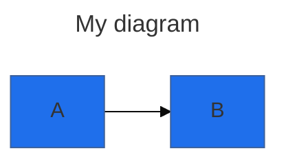
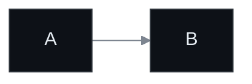

# Agent A — Foundations & Integration (Mermaid)

Scope owned: core concepts, configuration & directives, theming, classDef, integration matrix.
Out of scope (handled by other agents): specific diagram syntax (B/C), accessibility (D), performance (D), recent-changes verification (E).

---

## 1. Core concepts

### What Mermaid is
- JS library that parses a small DSL and emits SVG. Authors write text; library renders.
- Tagline framing: solves "doc rot" by putting diagrams in the same VCS as the code.
- 20+ diagram types. The full set: flowchart, sequence, class, state-v2, ER, journey, gantt, pie, quadrant, requirement, gitGraph, C4, mindmap, timeline, sankey, xychart, block, packet, kanban, architecture, radar, treemap, venn, ishikawa, treeview. (Several are flagged "experimental" in the docs nav with a flame emoji — flag for E.)

### Rendering model (this is the part that confuses people)
- At load, Mermaid scans the DOM for `<pre class="mermaid">` and `<div class="mermaid">` elements (the historical default; both are valid).
- For each match, it reads `textContent`, parses it, replaces the element's content with an inline `<svg>`.
- Single-shot by default. If you mutate the DOM after `mermaid.initialize`, you must call `mermaid.run()` (v10+) yourself — auto-discovery does not observe mutations.
- The library is large (single bundle ~700KB minified+gzipped, larger uncompressed). For SPAs, lazy-load it. For static sites, the CDN ESM build is fine.

### Diagrams-as-code, fenced-block convention
- The de-facto convention everyone has standardized on:
  ````
  ```mermaid
  flowchart LR
    A --> B
  ```
  ````
- This isn't part of the Mermaid spec — it's a Markdown-renderer convention. GitHub, GitLab, Obsidian, Notion, MkDocs, VS Code all key off the `mermaid` info-string after the triple backticks.
- The "raw HTML" equivalent (no Markdown layer) uses `<pre class="mermaid">` with the same content.

### Live editor (mermaid.live)
- URL: <https://mermaid.live>. The diagram source is encoded into the URL hash (pako-compressed JSON). Bookmark-stable, shareable.
- Renders live as you type, exports SVG/PNG, can save to Mermaid Chart cloud.
- Practical use: paste a broken diagram from a docs PR to find which line the parser hates. Faster than `mmdc`.
- Gotcha: the editor uses the latest Mermaid; GitHub/GitLab pin older versions, so a diagram that renders in mermaid.live can break on GitHub. Always sanity-check on the platform you're shipping to.

---

## 2. Configuration: three layers, one precedence rule

Order of precedence (lowest → highest, last wins):

| Layer | How set | Scope | Notes |
|------|--------|-------|-------|
| Defaults | built-in | global | what you get if you do nothing |
| Site config | `mermaid.initialize({...})` | every diagram on the page | call once, at page load |
| Frontmatter `config:` | `--- config: {...} ---` block in diagram | one diagram | preferred since v10.5.0 |
| Directive `%%{init: ...}%%` | inside diagram | one diagram | **deprecated v10.5.0+** but still works |

A "secure list" (`secure: [...]`) in `mermaid.initialize` locks specific keys so per-diagram overrides cannot touch them. Default secure keys: `secure`, `securityLevel`, `startOnLoad`, `maxTextSize`, `maxEdges`. If you embed user-provided diagrams, treat this as mandatory hardening.

### `mermaid.initialize()` — the keys you actually set

```js
mermaid.initialize({
  startOnLoad: true,        // auto-run on DOMContentLoaded; set false if you call mermaid.run() yourself
  securityLevel: 'strict',  // strict | loose | antiscript | sandbox
  theme: 'default',         // default | dark | forest | neutral | base
  themeVariables: { /* ... only meaningful with theme: 'base' */ },
  themeCSS: '.node rect { ... }',  // raw CSS injection — only effective at securityLevel: 'loose'
  fontFamily: '"trebuchet ms", verdana, arial, sans-serif',
  logLevel: 'fatal',        // 'debug' | 'info' | 'warn' | 'error' | 'fatal' or 1..5
  flowchart: { curve: 'basis', htmlLabels: true, useMaxWidth: true },
  sequence: { mirrorActors: true, wrap: false },
  gantt: { /* ... */ },
  // ... per-diagram namespaces
});
```

### `securityLevel` — the table the docs make you click around for

| Value | HTML in labels | Click handlers | Iframe | Use when |
|------|----------------|----------------|--------|---------|
| `strict` (default) | escaped | disabled | no | rendering untrusted user input |
| `antiscript` | allowed minus `<script>` | enabled | no | mostly trusted, want links |
| `loose` | fully allowed | enabled | no | your own docs only |
| `sandbox` | iframe-isolated | limited | yes | "unknown source, render anyway" |

Important: `themeCSS`, click bindings to JS functions, and HTML labels containing styling all require `loose`. People who can't get a custom theme to apply 80% of the time are stuck on `strict`.

### Frontmatter (preferred, v10.5.0+)



Rules:
- The triple-dashes must be the only content on their lines.
- It's YAML, so indentation matters and quoting hex colors is safer (`"#fff"`, not `#fff` — `#` starts a YAML comment).
- Mermaid silently ignores misspelled keys. Misspelled values can break the diagram. If your config seems to do nothing, the field name is wrong.
- The `title:` key renders as a diagram title above the SVG (handy; saves you from a label hack).

### Directives (legacy, still works)

```
%%{init: {"theme": "dark", "flowchart": {"curve": "linear"}}}%%
flowchart LR
  A --> B
```

- Either `init` or `initialize` works as the keyword.
- Multiple `%%{init}%%` blocks merge with last-wins.
- Comments in Mermaid use `%%` (line). **Never put `{}` inside a `%%` comment** — the parser confuses it for a directive and breaks the diagram. A real footgun.

---

## 3. Theming

### The 5 themes

| Theme | Use case | Customizable? |
|------|---------|---------------|
| `default` | general light UIs | no — overriding `themeVariables` has limited effect |
| `dark` | dark backgrounds | no |
| `forest` | green palette | no |
| `neutral` | print/B&W | no |
| `base` | foundation for all custom themes | **yes — the only customizable theme** |

Non-obvious: if you want any non-trivial color override to actually take effect, switch to `theme: 'base'` first. Setting `themeVariables` on `default` mostly silently no-ops because the default theme's stylesheet hard-codes values that override the variable layer. This is the #1 theming gotcha.

### Theme variables (the load-bearing ones)

Globals (apply to all diagrams):
- `primaryColor` — main node fill. Most other colors are derived from it.
- `primaryTextColor` — text inside primary-colored nodes
- `primaryBorderColor` — border for primary-colored nodes
- `secondaryColor`, `tertiaryColor` (+ `*TextColor`, `*BorderColor`)
- `lineColor` — edges
- `background` — diagram background
- `mainBkg`, `secondBkg` — node backgrounds
- `darkMode: true | false` — flips the derivation algorithm; set this when picking a dark `primaryColor`
- `fontFamily`, `fontSize` (px)

Diagram-specific (selected):
- Flowchart: `nodeBorder`, `clusterBkg`, `clusterBorder`, `defaultLinkColor`, `titleColor`, `edgeLabelBackground`
- Sequence: `actorBkg`, `actorBorder`, `actorTextColor`, `actorLineColor`, `signalColor`, `signalTextColor`, `labelBoxBkgColor`, `labelBoxBorderColor`, `noteBorderColor`, `noteBkgColor`, `activationBkgColor`
- Gantt: `sectionBkgColor`, `altSectionBkgColor`, `taskBkgColor`, `taskTextColor`, `gridColor`, `doneTaskBkgColor`, `critBkgColor`
- Pie: `pie1` through `pie12` (slot-indexed slice colors), `pieStrokeColor`, `pieOpacity`
- State/Class: `labelColor`, `altBackground`, `classText`

### Color rules
- **Hex only.** `red`, `rebeccapurple`, `rgb(...)` — none of these work. The variable layer parses hex strings with `tinycolor` and silently drops anything else. This burns hours.
- Most variables are derived from `primaryColor` if not explicitly set. Override `primaryColor` and most of the diagram restyles coherently. Override one downstream variable and you get inconsistent siblings — set the whole family or none.
- `darkMode: true` flips the derivation math (lightens borders against dark fills instead of darkening them). Forgetting this when going dark gives you the "everything is unreadable" effect.

### `themeCSS` — escape hatch
- Raw CSS string injected into the SVG's `<style>`. Targets internal Mermaid class names (`.node rect`, `.edgePath`, `.actor`, etc.).
- Only works at `securityLevel: 'loose'`. Stripped under `strict`.
- Use when `themeVariables` doesn't expose what you want (e.g. dasharray on a specific edge type).

### Custom theme idiom



### Dark-mode auto-detection (no docs page; idiom from the wild)

Mermaid has no built-in OS dark-mode hook. The pattern:

```js
const dark = window.matchMedia('(prefers-color-scheme: dark)').matches;
mermaid.initialize({
  startOnLoad: false,
  theme: dark ? 'dark' : 'default',
});
mermaid.run();

// Optional: re-render on theme switch
window.matchMedia('(prefers-color-scheme: dark)').addEventListener('change', (e) => {
  // Mermaid has already replaced <pre> contents with <svg>; you must restore the source first.
  // Common workaround: keep the source in a data-attribute or re-read from server.
  mermaid.initialize({ theme: e.matches ? 'dark' : 'default' });
  // Re-render cycle requires either page reload or stashing original textContent before first run.
});
```

The "stash original `textContent` before first render" detail isn't in the docs, but it's the only way to support live theme toggling without a reload. Static-site theme toggles routinely ship broken because of this.

---

## 4. `classDef` — styling without CSS

The closest thing Mermaid has to a CSS class system. Works in flowchart, state, and class diagrams (syntax varies slightly per diagram, but the model is the same).

### Define
```
classDef warn fill:#fee,stroke:#c00,stroke-width:2px,color:#600;
classDef ok,info color:#fff;       /* multiple class names, one rule */
classDef default fill:#f9f;        /* applies to every node without a class */
```

The values are SVG/CSS attributes — `fill`, `stroke`, `stroke-width`, `stroke-dasharray`, `color` (text), `font-size`, `font-weight`, `font-style`. Comma-separated. Trailing semicolon optional but every doc example has one.

### Apply
Two syntaxes; pick one and stick with it:

```
class A,B,C warn;          %% statement form
A:::warn --> B:::ok        %% inline shorthand (note triple colons)
```

### Gotchas
- `:::` is **three** colons. Two colons is a parse error or, worse, silently parsed as a label.
- `class A warn` (statement form) lives on its own line. Putting it after a node definition with a semicolon is hit-or-miss across versions.
- The `default` class applies before any explicit class — explicit classes win on conflicting properties.
- Class names cannot contain spaces or hyphens reliably. Stick to `[A-Za-z0-9_]`.
- Quoting node IDs that contain reserved words (`end`, `default`) is required, but you cannot apply `:::` to a quoted-ID node directly — use the statement form for those.
- `classDef` does not cascade through subgraphs the way CSS does. A class applied to a subgraph header does not propagate to children.
- For sequence diagrams, `classDef` does not work; you style actors with theme variables only.

### When to use what
- One-off color: inline style on the node (e.g. `style A fill:#f9f`).
- Reused styling, 2-10 nodes: `classDef` + `class` statements.
- Site-wide diagram theming: `themeVariables` (or `themeCSS` if you need real selectors).

---

## 5. Integration matrix

The single table the blog audience actually needs. Embed pattern + the version/quirk fact you only know by hitting the wall.

### GitHub
- **Pattern**: ```` ```mermaid ```` fenced block in any `.md` file, issue, PR, discussion, wiki, gist.
- **Added**: Feb 2022 (general availability).
- **Quirks**:
  - Pinned to a specific Mermaid version per host. Run a code block containing just `info` to see which.
  - Heavy diagrams sometimes fail to render with no error message; reload usually fixes. No way to set theme/config at the repo level.
  - GitHub injects its own light/dark CSS variables, so themes adapt to the user's GitHub theme but only roughly.
  - Caveat from GitHub docs: "errors if you run a third-party Mermaid plugin" — browser extensions that also try to render Mermaid will collide.

### GitLab
- **Pattern**: same fenced block. Renders in `.md`, MRs, issues, wiki, snippets.
- **Version**: GitLab.com on Mermaid v10.
- **Quirks**:
  - Self-managed instances with `Cross-Origin-Resource-Policy: same-site` (or `same-origin`) silently fail to render. Admin must set `cross-origin`. Diagrams just don't appear; no error.
  - Supports `accTitle` / `accDescr` accessibility directives (D's territory, flagging).

### MkDocs — two routes

Route 1: **Material for MkDocs built-in** (recommended if already on Material).
```yaml
markdown_extensions:
  - pymdownx.superfences:
      custom_fences:
        - name: mermaid
          class: mermaid
          format: !!python/name:pymdownx.superfences.fence_code_format
```
- Native since Material 8.2.0. Inherits `mkdocs.yml` palette colors automatically. Works with instant-loading.
- Officially supports flowchart, sequence, state, class, ER. Other diagrams "render but not officially supported" — gantt/pie are flagged for poor mobile rendering.

Route 2: **mkdocs-mermaid2-plugin** (use when you need version pinning or non-Material themes).
```yaml
plugins:
  - search           # MUST list explicitly; declaring plugins disables the default search auto-load
  - mermaid2:
      version: 10.0.2
```
With Material theme, swap the superfences format function:
```yaml
        - name: mermaid
          class: mermaid
          format: !!python/name:mermaid2.fence_mermaid_custom
```
- Reasons to prefer mermaid2 over Material's built-in: pin a specific Mermaid version, customize JS init, use a non-Material MkDocs theme.

### Obsidian
- **Pattern**: native, ```` ```mermaid ```` block. No plugin needed.
- **Quirks**:
  - Theme alignment is the persistent pain point. Mermaid uses `default`/`dark`; Obsidian's many community themes do not always set `prefers-color-scheme`, so Mermaid picks the wrong theme. Sequence-diagram arrowheads, ER fills, and mindmap text colors are the recurring victims.
  - Workaround: Obsidian CSS Snippets that hard-override Mermaid's internal classes. Several community templates exist; this isn't a setting toggle.
  - No way to set per-vault Mermaid config. Per-diagram `%%{init}%%` or frontmatter is the only knob.

### VS Code
- **Top extension (basic)**: `bierner.markdown-mermaid` ("Markdown Preview Mermaid Support"). Adds rendering to the built-in Markdown preview. Zero config. The default recommendation.
- **Official Mermaid Chart extension** (`MermaidChart.vscode-mermaid-chart`): editor with live preview, AI-assisted repair, Mermaid Chart cloud sync. Heavier. Worth it if you're editing diagrams interactively, not just previewing them.
- **Quirk**: the built-in Markdown preview does NOT render Mermaid by default; you must install one of these. Many users assume it's native because GitHub renders Mermaid natively.

### Notion
- **Added**: Dec 23, 2021.
- **Pattern**: insert a `/code` block, set language to `Mermaid`. Top-left dropdown of the code block toggles Code / Preview / Split.
- **Quirks**:
  - Pinned to an old Mermaid version. mindmap support is partial; `classDef` and many arrow style modifiers are silently ignored.
  - No way to set theme globally; per-diagram directive only.
  - Export (PDF/print) sometimes captures the code, not the rendered diagram, depending on the toggle state at export time.

### Confluence
- No native support. Requires marketplace plugin (Mermaid Plugin for Confluence, Markdown Macro, etc.). Out of scope of this blog post unless reader asks.

### `mmdc` — `@mermaid-js/mermaid-cli`

```bash
npm install -g @mermaid-js/mermaid-cli
mmdc -i diagram.mmd -o diagram.svg
mmdc -i README.md   -o README.out.md     # processes embedded ```mermaid blocks
```

Flags worth knowing:

| Flag | Purpose |
|------|---------|
| `-i, --input` | input `.mmd` or `.md` |
| `-o, --output` | output; extension picks format (`.svg`, `.png`, `.pdf`, `.md`) |
| `-t, --theme` | one of the five themes |
| `-b, --backgroundColor` | `transparent`, hex, or named CSS color (here named colors actually work, contrary to themeVariables) |
| `-c, --configFile` | path to JSON Mermaid config (same shape as `mermaid.initialize`) |
| `-C, --cssFile` | inject CSS file |
| `-w, --width`, `-H, --height` | output dimensions in px |
| `-p, --puppeteerConfigFile` | for headless-Chrome args (sandbox flags etc.) |
| `-s, --scale` | DPI multiplier for PNG/PDF |

Quirks:
- Pulls a full Puppeteer + Chromium download on install (~150MB). Surprises CI users.
- On Linux (especially Docker), the default Chromium sandbox refuses to run as root. Either run as non-root or pass `--no-sandbox` via `-p` config:
  ```json
  { "args": ["--no-sandbox"] }
  ```
- The Markdown mode replaces `\`\`\`mermaid` blocks with image references (`./out-1.svg`, etc.) and emits the images alongside. Useful for static-site pre-rendering when you don't want a JS dependency at runtime.
- Official Docker image `minlag/mermaid-cli` avoids the sandbox/Puppeteer install ritual.

### Raw HTML embed (the canonical pattern)

```html
<pre class="mermaid">
flowchart LR
  A --> B
</pre>

<script type="module">
  import mermaid from 'https://cdn.jsdelivr.net/npm/mermaid@11/dist/mermaid.esm.min.mjs';
  mermaid.initialize({ startOnLoad: true });
</script>
```

Notes:
- ESM build only; the legacy UMD build still ships but the docs only show ESM as of v10+.
- `startOnLoad: true` triggers auto-discovery once. For SPAs / dynamic content: `startOnLoad: false`, then `await mermaid.run({ querySelector: '.mermaid' })` after each DOM mutation.
- jsdelivr is the canonical CDN in the docs; unpkg works equally.
- For air-gapped/offline deployments, copy `mermaid.esm.min.mjs` and its associated `chunks/*` from the npm tarball — it's not a single file despite the import looking like one. Several people get bitten copying just the entry file.

---

## 6. Cross-cutting gotchas (the "save them the slog" pile)

1. **`%%` comments cannot contain `{}`.** The parser sees `{` and tries to read a directive. Breaks the entire diagram with no clear error.
2. **Reserved words break diagrams.** `end` in flowchart and sequence is the most common offender. Quote labels that contain them: `A["end"] --> B`.
3. **Mermaid silently ignores misspelled config keys.** No warning. If your config does nothing, check spelling first.
4. **`themeVariables` only meaningfully applies under `theme: 'base'`.** Setting variables on `default`/`dark`/`forest`/`neutral` partially works at best. The other four themes have hardcoded styles overriding the variable layer.
5. **Hex colors only in `themeVariables`.** Named colors (`red`) are silently dropped. Three-digit hex (`#f09`) works.
6. **`themeCSS` requires `securityLevel: 'loose'`.** Stripped silently under `strict` (the default). Same for click handlers and HTML labels.
7. **`:::` is three colons.** Two-colon typo is a hard-to-spot bug.
8. **Auto-discovery is one-shot.** Inject diagrams via JS framework after init? Call `mermaid.run()` yourself.
9. **Mermaid replaces the `<pre class="mermaid">` content with SVG on first render.** Live theme toggles need to stash the original source before init or they have nothing to re-render.
10. **GitHub/GitLab/Notion pin Mermaid versions.** Diagrams that work in mermaid.live (latest) may break on a host running v10.x. Test on the actual platform.
11. **`mmdc` needs a Chromium sandbox flag in Docker.** Default failure mode: silent hang or "no usable sandbox" error.
12. **Diagrams of >maxTextSize / >maxEdges silently truncate.** Defaults: 50000 chars / 500 edges. Bump in `mermaid.initialize` for large architecture diagrams.
13. **Frontmatter is YAML.** Quote hex colors. `#fff` is a YAML comment.
14. **Mermaid is ~700KB gzipped.** Lazy-load on docs sites if you care about LCP.
15. **The "experimental" diagrams** (sankey, packet, kanban, architecture, radar, treemap, venn, ishikawa, treeview, xychart, block) — flagged for E to verify status. Foundation/integration patterns are the same; coverage on hosts (GitHub/GitLab) lags the spec.

---

## 7. Design reasoning (where it has rough edges, and why)

- **Why a `<pre>` parse-and-replace model?** It made Mermaid trivially droppable into any markdown renderer that doesn't know about Mermaid — render the markdown, then run Mermaid as a post-pass. That's why every host can integrate it with three lines of config. The cost: dynamic content / theme toggles fight the model, because the source is gone after the first render.
- **Why is `base` the only customizable theme?** The other four bake their look into a stylesheet for predictability across versions. `base` is the explicitly-mutable seed. The trade-off: most users find `default`, try to override colors, get nothing, and don't realize they were supposed to switch to `base`. This is a documentation failure more than a design one.
- **Why deprecate directives in favor of frontmatter?** Frontmatter (YAML) is parseable by external tools without understanding Mermaid syntax — static site generators, indexers, search. Directives are inline DSL. The migration is cosmetic; both still work.
- **Why hex-only color parsing?** `tinycolor` is used internally and the library wants the math operations (lighten/darken for derivations) to be reliable. Named colors require a CSS context that doesn't exist during SVG generation. Defensible; underdocumented.
- **Why is `classDef` flowchart-centric?** Class diagrams have `cssClass` (different syntax). Sequence has none. The diagrams were written by different contributors at different times; the styling story was never unified. This is the single largest piece of friction for people building polished diagrams.

---

Word count target: 1500-2500. This document: ~2400 words of structured reference (excluding code).
