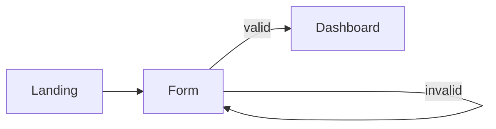
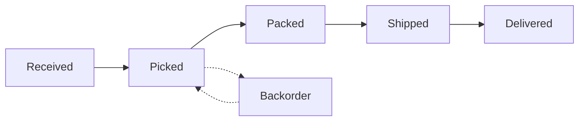
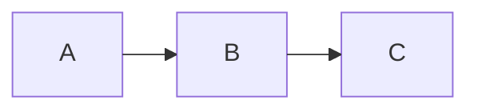

# Agent D — Accessibility + Performance / Scaling

Scope: cross-cutting real-world concerns. The stuff readers hit after their first "wow, it works!" moment — when someone runs an a11y audit, when the 200-node graph appears, when the bundle analyzer surfaces 600 KB of mermaid code on a page that doesn't render diagrams.

Note for Agent E (recent-changes verification): two facts below should be re-checked against current docs before publication — (1) ELK was moved out of core into `@mermaid-js/layout-elk` around v11; (2) the `securityLevel: 'sandbox'` mode is still flagged "beta" in some docs but has been around since v10. Both are version-sensitive.

---

## Section 1 — Accessibility

### 1.1 The blunt truth

A Mermaid diagram is an `<svg>`. Out of the box, a screen reader reads "graphic" or — if you set `accTitle` — your title, plus `aria-roledescription` (e.g. "flowchart-v2"). It does **not** read the nodes. It does **not** read the edges. It cannot describe the *relationships* the diagram exists to communicate.

So the accessibility story for Mermaid is not "Mermaid has a11y features, use them." It's: **Mermaid gives you two hooks (`accTitle`, `accDescr`) and the rest is on you.** The author is responsible for the prose alternative. If you don't write one, your diagram is a black box to non-sighted users.

That framing should drive the rest of this section.

### 1.2 `accTitle` and `accDescr` — syntax

Both keywords work inside the diagram body, after the diagram-type declaration. Three forms:

| Form | Syntax | Notes |
|---|---|---|
| Single-line title | `accTitle: My diagram title` | Colon required. One line. |
| Single-line description | `accDescr: A short prose description.` | Colon required. One line. |
| Multi-line description | `accDescr {` ... `}` | **No colon.** Curly braces. Whitespace inside is preserved. |

Example for a flowchart:



### 1.3 Which diagrams support it

Per the official accessibility page, support is claimed for "all diagrams/chart types" with worked examples for: flowchart, class, ER, gantt, gitGraph, pie, requirement, sequence, state, user-journey.

**Gaps surfaced from issue tracker (verify with Agent E):**
- `mindmap` — `accTitle` / `accDescr` not supported (issue #4167)
- `block-beta` — not supported (issue #6524)

If you use those diagram types, the keywords parse silently as content / errors out depending on version. Don't assume universal coverage.

### 1.4 What the SVG actually looks like

When you set the keywords, Mermaid emits:

```html
<svg
  aria-roledescription="flowchart-v2"
  aria-labelledby="chart-title-mermaid-1234"
  aria-describedby="chart-desc-mermaid-1234"
  role="graphics-document document">
  <title id="chart-title-mermaid-1234">User signup flow</title>
  <desc id="chart-desc-mermaid-1234">Three-step funnel: the user...</desc>
  <!-- nodes and edges -->
</svg>
```

Three things to notice:

1. `aria-roledescription` is **always set**, even when you provide no `accTitle`. It's the diagram-type identifier (`flowchart-v2`, `sequenceDiagram`, etc). Sighted users don't see this; screen-reader users hear something like "flowchart-v2 graphics-document" — which is jargon, not useful information.
2. `aria-labelledby` and `aria-describedby` only appear when you set the keywords. Without them, the SVG has no accessible name and most screen readers will skip it or announce only "graphic."
3. The `<title>` and `<desc>` are real SVG elements, not ARIA attributes. This matters because some tools (e.g. PDF exporters, image-to-text pipelines) read `<title>`/`<desc>` even when they ignore ARIA.

### 1.5 What screen readers actually announce

| Scenario | NVDA / JAWS / VoiceOver behaviour (approximate) |
|---|---|
| No `accTitle`, no `accDescr` | "graphic" or silence — SVG is not announced as meaningful content |
| `accTitle` only | Announces the title once, then nothing about contents |
| `accTitle` + `accDescr` | Announces title, then reads the description prose |
| Inside `securityLevel: 'sandbox'` | Same as above, but content is inside a same-origin iframe — some screen readers cross the iframe boundary cleanly, others lose focus |

What the screen reader **never** does: walk the node graph, read edge labels, describe layout, or convey "A points to B." If the meaning of your diagram is in its structure, the description prose has to encode that structure linguistically.

This is not a Mermaid bug — it's an inherent SVG-as-graphic problem. SVG-as-document with proper `<g role="graphics-symbol">` tagging exists, but Mermaid does not emit it, and tooling support is patchy.

### 1.6 Color contrast and theme WCAG status

The mermaid-js project openly tracks "ensure all themes pass WCAG AA in light and dark modes" as **open work** (issue #3691). Current status is uneven:

| Theme | WCAG AA contrast (text on node fill) | Notes |
|---|---|---|
| `default` | Generally passes for body text; edge labels can be marginal | Safest default |
| `neutral` | Generally passes | Grayscale; high contrast |
| `dark` | Mostly passes; some edge-label combinations fail | |
| `forest` | Several node/text combinations fail AA | Greens on greens |
| `base` (with custom `themeVariables`) | Depends entirely on what you set | Audit your overrides |

Also worth knowing:
- **Specifying any theme overrides automatic dark-mode detection.** If you set `theme: 'default'` and the user's OS is in dark mode, you'll often get an unreadable result. Either commit to a theme and accept that, or leave `theme` unset and let Mermaid's defaults track the surrounding CSS.
- **`themeCSS` and `themeVariables` are how you fix contrast issues without forking a theme.** Audit your specific node/text combinations with a contrast checker — don't trust the theme name.

How to check: render the diagram, open DevTools, run an axe or Lighthouse audit on the page. The relevant SC are 1.4.3 (Contrast Minimum) for text inside nodes, and 1.4.11 (Non-text Contrast) for the node borders and edges themselves.

### 1.7 The prose-alternative pattern (the part most posts skip)

Because `accDescr` is the only thing a screen reader will hear about the diagram's *content*, treat it as a real piece of writing — not a label. A useful template:



Notice the description names every node, names the linear flow, and explicitly calls out the cycle. That's the standard for "long description" alt-text on data visualisations (see also the WAI-ARIA Authoring Practices for `figure` patterns).

For diagrams that genuinely cannot be summarised in a paragraph (large architecture maps, complex sequence diagrams), the right move is **a `<figure>` wrapper with a separate `<figcaption>` and a linked long description**:

```html
<figure role="figure" aria-labelledby="fig-7-caption">
  <div class="mermaid">
    flowchart LR
      accTitle: Service mesh topology
      accDescr: See long description below the diagram.
      ...
  </div>
  <figcaption id="fig-7-caption">
    Figure 7: Service mesh topology.
    <a href="#fig-7-longdesc">Read full description</a>.
  </figcaption>
</figure>
<details id="fig-7-longdesc">
  <summary>Full description of Figure 7</summary>
  <p>The mesh has three tiers...</p>
</details>
```

This is the W3C-recommended pattern for complex images. Mermaid does not provide it; you assemble it around the diagram.

### 1.8 Keyboard navigation

Mermaid renders **non-interactive SVG by default**. There is nothing to focus, nothing to tab to, no keyboard story to test.

The exceptions:
- **`click` directives** in flowcharts and class diagrams can bind URLs or callbacks. These attach to the `<g>` element for the node but do **not** make it keyboard-focusable. You'll need to add `tabindex="0"` and a keyboard handler manually after render, or wrap the diagram in your own focusable controls.
- **`securityLevel: 'sandbox'`** wraps the diagram in an iframe. The iframe itself is focusable; tabbing through the page enters and exits the iframe, but contents are still not keyboard-navigable.

If you're building something where the user is *meant* to interact with diagram nodes, Mermaid is the wrong primitive — use a real graph library (Cytoscape, vis.js) with proper a11y patterns, or post-process the Mermaid output to add focus rings, `tabindex`, `role="button"`, and arrow-key handlers. Note this limitation up front.

---

## Section 2 — Performance / Scaling

### 2.1 The shape of the failure mode

The classic Mermaid performance complaint is some variant of: "I have ~150 nodes and ~300 edges, render takes 4–8 seconds, and the layout is spaghetti." This is rarely a JavaScript-engine problem and almost always a **layout-engine** problem — `dagre` is doing a lot of work to produce a poor result.

Failure-mode breakdown:

| Symptom | Usual cause | First lever to pull |
|---|---|---|
| Slow render (multi-second) on 100+ nodes | Dagre layout cost | Switch to ELK |
| Crossing edges, unreadable layout | Dagre on dense graphs | Switch to ELK, or split the diagram |
| `Maximum text size in diagram exceeded` | `maxTextSize` (default 50000) | Raise `maxTextSize` |
| `Too many edges` error | `maxEdges` (default 500) | Raise `maxEdges`, or split |
| Whole page hangs while diagrams render | Eager init blocking main thread | Switch to manual `mermaid.run` + lazy/IO observer |
| 600 KB+ on every page | Mermaid loaded eagerly into main bundle | Dynamic import + presence check |

### 2.2 Layout engines

Three layout engines have existed in Mermaid history; only two are current.

| Engine | Status | Strengths | Weaknesses |
|---|---|---|---|
| **dagre** | Default for flowchart, class, state | Fast on small graphs (≲50 nodes), zero install | Layout quality degrades sharply on dense / hierarchical / nested graphs; produces edge crossings ELK avoids |
| **ELK** (Eclipse Layout Kernel) | Opt-in; introduced v9.4, moved to `@mermaid-js/layout-elk` package around v11 | Significantly better layout on large/hierarchical graphs; handles deep subgraphs and many edges without spaghetti | Slower on small graphs (algorithm is more sophisticated); requires extra package install in v11+ |
| **dagre-d3** | Legacy / removed | — | Don't use; unmaintained |

Switch to ELK with **frontmatter** (per-diagram, recommended):



Or **globally** via initialize:

```js
mermaid.initialize({
  flowchart: { defaultRenderer: 'elk' }
});
```

In v11+ you must also register the loader:

```js
import mermaid from 'mermaid';
import elkLayouts from '@mermaid-js/layout-elk';

mermaid.registerLayoutLoaders(elkLayouts);
mermaid.initialize({ flowchart: { defaultRenderer: 'elk' } });
```

Rule of thumb: **dagre for small flowcharts and sequence-style diagrams, ELK for anything with subgraphs, multiple sources/sinks, or more than ~50 nodes.** If a diagram looks like a tangle in dagre, ELK will almost always fix it; the cost is ~100–300 ms more layout time and one extra dependency.

### 2.3 Hard limits — `maxTextSize`, `maxEdges`, plus the zoom caps

| Option | Default | What it gates | Override |
|---|---|---|---|
| `maxTextSize` | `50000` | Total length of the diagram source string | `mermaid.initialize({ maxTextSize: 200000 })` |
| `maxEdges` | `500` | Number of edges in a single diagram | `mermaid.initialize({ maxEdges: 2000 })` |
| `maxScale` (or `maxZoom`, varies by diagram) | varies | Zoom ceiling for diagrams that support pan/zoom | `mermaid.initialize({ maxScale: 8 })` |

Critical detail: **these are "secure" config keys**. They can only be set via `mermaid.initialize(...)` from the host page. They are intentionally NOT overridable from `%%{init: ...}%%` directives or YAML frontmatter inside a diagram. This is a security choice — a user-supplied diagram cannot lift the host's resource limits. If raising the limit doesn't take effect, you've almost certainly tried to set it inside the diagram.

Error modes when exceeded:

- `maxTextSize` exceeded → renders a syntax-error-style diagram with text "Maximum text size in diagram exceeded" (unless `suppressErrorRendering: true`, in which case the diagram silently fails to render)
- `maxEdges` exceeded → renders an error diagram with "Too many edges" message
- Both errors are *fatal* for the affected diagram — there is no partial render

When you find yourself bumping these limits, **first ask whether the diagram is the right shape**. A 1000-edge flowchart is rarely readable by a human. The limit is usually telling you the truth.

### 2.4 `securityLevel` performance

Four values: `strict` (default), `loose`, `antiscript`, `sandbox`.

| Level | What it does | Performance cost |
|---|---|---|
| `strict` | Encodes HTML in labels; no script execution | Baseline |
| `antiscript` | Allows HTML in labels but strips scripts | Negligible — adds a sanitization pass |
| `loose` | Allows HTML and scripts (e.g. for `click` callbacks calling functions) | Negligible — skips sanitization |
| `sandbox` | Renders inside a sandboxed iframe | **Measurable**. Iframe creation, separate document, separate style resolution. Counted in tens of ms per diagram, plus memory overhead per iframe. |

For most apps, `securityLevel` is a security/feature choice, not a performance choice. The exception is `sandbox` — if you're rendering many small diagrams (say, a list of 30 inline diagrams in a docs page) and using `sandbox`, you'll feel it. Either consolidate into fewer larger diagrams or drop to `antiscript`.

### 2.5 Lazy initialization for SPAs

The default `startOnLoad: true` runs Mermaid against `.mermaid` elements **once**, on `DOMContentLoaded`. For SPAs and any framework that mounts content after page load, this is wrong — diagrams injected later sit there as raw text.

The pattern:

```js
import mermaid from 'mermaid';

mermaid.initialize({
  startOnLoad: false,        // do NOT auto-run on load
  securityLevel: 'strict',
  theme: 'default',
});

// Whenever new diagrams enter the DOM:
await mermaid.run({ querySelector: '.mermaid' });
```

`mermaid.run()` is idempotent on already-rendered diagrams when those diagrams have been marked `data-processed="true"` (which Mermaid sets after the first successful render). So it's safe to call on every route change.

For finer control, render specific elements:

```js
await mermaid.run({
  nodes: [document.getElementById('diagram-7')],
});
```

Or render programmatically without touching the DOM:

```js
const { svg, bindFunctions } = await mermaid.render('graph-id', diagramSource);
container.innerHTML = svg;
bindFunctions?.(container);
```

**Pitfall: don't call `mermaid.run()` inside React's render — it mutates the DOM.** Use `useEffect` or the framework's equivalent post-mount hook. Calling during render causes double-renders and "node already processed" warnings.

### 2.6 Render-on-demand with IntersectionObserver

For pages with many diagrams (long-form docs, design-system catalogs), rendering them all up-front is wasteful. The pattern:

```js
const io = new IntersectionObserver((entries) => {
  for (const entry of entries) {
    if (entry.isIntersecting) {
      mermaid.run({ nodes: [entry.target] });
      io.unobserve(entry.target);
    }
  }
}, { rootMargin: '200px' });

document.querySelectorAll('.mermaid:not([data-processed="true"])')
  .forEach(el => io.observe(el));
```

Two notes:
- `rootMargin: '200px'` starts the render slightly before the diagram enters the viewport. Tune for your scroll speed; smaller value means more "popping in", larger means more wasted work if the user never reaches that scroll position.
- Once `data-processed="true"` is set, `unobserve` to free the observer slot.

For very large pages, combine with the lazy-load pattern below — first lazy-load the library itself, then lazy-render individual diagrams.

### 2.7 Bundle size

Mermaid is **big**. Numbers from the Mermaid maintainers' own bundle-shrinking work:

| Variant | Unminified | Minified | Gzipped |
|---|---|---|---|
| Full mermaid (pre-shrink) | ~2.28 MB | ~1.15 MB | ~460 KB |
| Full mermaid (current) | ~1.56 MB | ~900 KB | ~315 KB |
| `@mermaid-js/tiny` | smaller | ~half full | — |

Tiny package caveats: it drops mindmap, architecture, KaTeX (math labels), and lazy-loading support. Read the package readme before adopting.

Tree-shaking situation, blunt version: **Mermaid is not effectively tree-shakeable.** Diagram parsers are wired into a registry at module init. If you import `mermaid`, you get all the diagram types whether you use them or not. v10/v11 added internal lazy-loading for some diagram types, but from the consumer's point of view, the `mermaid` module is a single fat dependency.

Practical consequences:
1. **Never put `mermaid` in your global / app-shell bundle if most pages don't have diagrams.** Code-split it per-route.
2. **Dynamic-import on first need:**

   ```js
   let mermaidPromise;
   async function ensureMermaid() {
     if (!mermaidPromise) {
       mermaidPromise = import('mermaid').then(({ default: mermaid }) => {
         mermaid.initialize({ startOnLoad: false });
         return mermaid;
       });
     }
     return mermaidPromise;
   }
   ```
3. **CDN-load on detection** (the simplest pattern, used by static-site generators): scan the rendered DOM for `.mermaid` elements; if none present, never load Mermaid at all.

For static-site usage where Mermaid is only needed at build time, **render to SVG with `mmdc`** (`@mermaid-js/mermaid-cli`) and ship the SVG. This drops Mermaid out of the runtime entirely:

```bash
mmdc -i diagram.mmd -o diagram.svg
```

Then inline the SVG with `accTitle` and `accDescr` already baked in. Best a11y, best performance, no JS cost. The only loss is dynamic theming.

### 2.8 Quick checklist for "my Mermaid page is slow"

1. Open Performance panel; record a render. Is time in `dagre` layout? → Switch to ELK.
2. Bundle analyzer: is `mermaid` in your main chunk? → Dynamic import.
3. Is `startOnLoad: true` on a SPA? → Set false, call `mermaid.run()` on route change.
4. Many diagrams below the fold? → IntersectionObserver pattern.
5. Hitting `maxTextSize` / `maxEdges`? → First ask if the diagram is the wrong tool; only then raise the limit.
6. Static content? → Pre-render with `mmdc`, ship SVG, drop the runtime.

---

## Sources

Accessibility:
- [Mermaid — Accessibility Options](https://mermaid.js.org/config/accessibility.html)
- [GitHub mermaid-js#2732 — More Accessible Mermaid Charts](https://github.com/mermaid-js/mermaid/issues/2732)
- [GitHub mermaid-js#3691 — All themes pass WCAG AA](https://github.com/mermaid-js/mermaid/issues/3691)
- [GitHub mermaid-js#5632 — Screen reader / a11y tech support](https://github.com/mermaid-js/mermaid/issues/5632)
- [GitHub mermaid-js#4167 — accTitle/accDescr not supported in mindmaps](https://github.com/mermaid-js/mermaid/issues/4167)
- [GitHub mermaid-js#6524 — accTitle/accDescr in block-beta](https://github.com/mermaid-js/mermaid/issues/6524)
- [Princeton — Accessible Mermaid charts in GitHub Markdown](https://pulibrary.github.io/2023-03-29-accessible-mermaid)

Performance / config:
- [Mermaid — Configuration](https://mermaid.js.org/config/configuration.html)
- [Mermaid — MermaidConfig interface](https://mermaid.js.org/config/setup/mermaid/interfaces/MermaidConfig.html)
- [Mermaid — Usage](https://mermaid.js.org/config/usage.html)
- [Mermaid — Flowchart syntax (defaultRenderer)](https://mermaid.js.org/syntax/flowchart.html)
- [npm `@mermaid-js/layout-elk`](https://www.npmjs.com/package/@mermaid-js/layout-elk)
- [npm `@mermaid-js/tiny`](https://www.npmjs.com/package/@mermaid-js/tiny)
- [DeepWiki — Mermaid Layout Engines](https://deepwiki.com/mermaid-js/mermaid/2.3-layout-engines)
- [Sidharth Vinod — Shrinking Mermaid >30%](https://www.sidharth.dev/posts/shrinking-mermaid/)
- [Rick Strahl — Lazy Loading the Mermaid Diagram Library](https://weblog.west-wind.com/posts/2025/May/10/Lazy-Loading-the-Mermaid-Diagram-Library)
- [GitHub mermaid-js#5042 — Too many edges error](https://github.com/mermaid-js/mermaid/issues/5042)
- [GitHub mermaid-js#1341 — Document maxTextSize](https://github.com/mermaid-js/mermaid/issues/1341)
- [GitHub mermaid-js Discussion #6249 — maxTextSize in init directive](https://github.com/orgs/mermaid-js/discussions/6249)
- [GitHub mermaid-js#3153 — Sandbox parse-error iframe duplication](https://github.com/mermaid-js/mermaid/issues/3153)
- [GitHub mermaid-js#5034 — Sandbox dark-mode responsiveness](https://github.com/mermaid-js/mermaid/issues/5034)
- [GitHub mermaid-js Discussion #4314 — Bundle size since v9.3](https://github.com/orgs/mermaid-js/discussions/4314)
